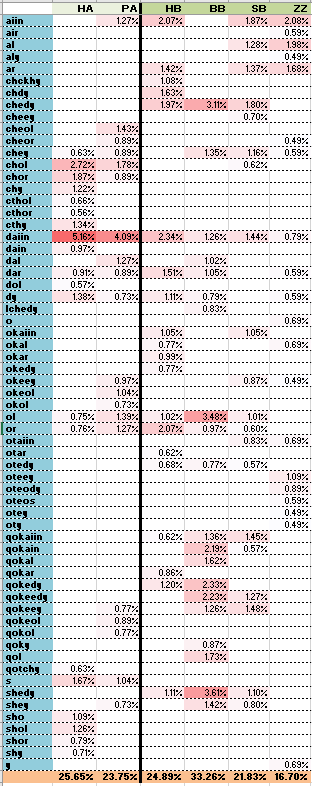
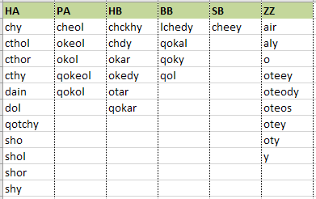

## Note 004 - On Terms

_Last updated Sep. 18th, 2021._

_This note refers to [release v.4.0.0](https://github.com/mzattera/v4j/tree/v.4.0.0) of v4j;
**links to classes and files refer to this release** and files might have been changed, deleted or moved in the current master branch.
In addition, some of this note content might have become obsolete in more recent versions of the library._

_Working notes are not providing detailed description of algorithms and classes used; for this, please refer to the 
library code and JavaDoc._

_Please refer to the [home page](..) for a set of definitions that might be relevant for this working note._

[**<< Home**](..)

---

The class
['MostUsedTerms'](https://github.com/mzattera/v4j/blob/v.4.0.0/eclipse/io.github.mzattera.v4j-apps/src/main/java/io/github/mattera/v4j/applications/MostUsedTerms.java)
finds top 20 most used terms for each cluster defined in [Note 003](../003) and prints out the result in .CSV format.

An Excel file ("`MostUsedTerms.xlsx`") containing this data can be found under the
[analysis folder](https://github.com/mzattera/v4j/tree/master/resources/analysis).

The below table summarizes the results, showing, the relative frequency of terms in each cluster.

As expected from cluster analysis, beside terms that appear frequently in all clusters (such as 'chey', 'daiin', 'dar', 'dy', and 'or'),
there are terms characteristic of a single cluster; the table below shows them.

It might be interesting to note that:

- Most common terms in Herbal A pages (HA cluster) start with 'ch-' or 'sh-'; the latter prefix appearing only here,

- Pharmaceutical (PA cluster) common terms end in '-ol', which is rare for other clusters. In addition, they seem to prefer the 'ok-' or 'qok-' prefix.

- Herbal B pages (HB cluster) prefer terms starting with 'qo-' and 'qok-'.

- Zodiac (ZZ) common terms mostly start with 'ot-', this is uncommon for clusters above. Moreover, these pages feature single characters as common terms.

---

[**<< Home**](..)

Copyright Massimiliano Zattera.

 This work is licensed under a <a rel="license" href="http://creativecommons.org/licenses/by-nc-sa/4.0/">Creative Commons Attribution-NonCommercial-ShareAlike 4.0 International License</a>.
