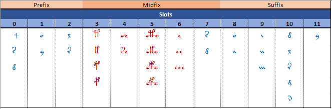
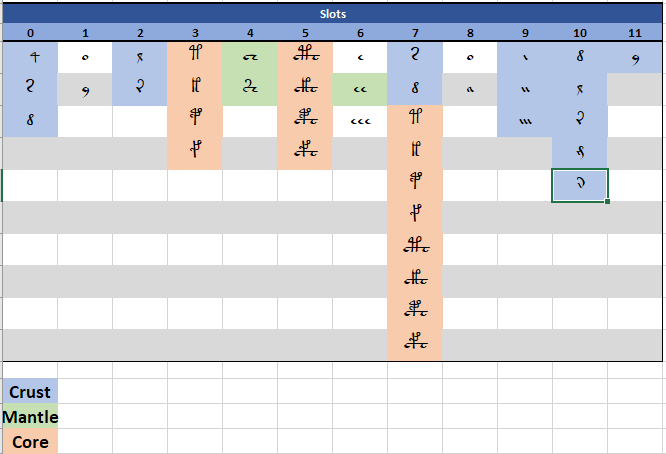

# Note 006 - Works on Word Structure

_Last updated Apr. 2nd, 2022._

_This note refers to [release v.7.0.0](https://github.com/mzattera/v4j/tree/v.7.0.0) of v4j;
**links to classes and files refer to this release**; files might have been changed, deleted or moved in the current master branch.
In addition, some of this note content might have become obsolete in more recent versions of the library._

_Working notes are not providing detailed description of algorithms and classes used; for this, please refer to the 
library code and JavaDoc._

_Please refer to the [home page](..) for a set of definitions that might be relevant for this working note._

[**<< Home**](..)

---


In this page I will list, review, and comment works from different authors about the inner structure of Voynich words.
When appropriate. A comparison of these models with a new grammar I propose, can be found in [Note 008](../008).

Numbers in square brackets in titles indicate the date when corresponding works were published (as far as I can determine it).


# John H. Tiltman [1967]

Please see my [review](../R001) of [TILTMAN (1967)](../biblio.md). In a nutshell:

  "_(j) Speaking generally, each symbol behaves as if it had its own
place in an "order of precedence" within words; some symbols such as
'o' and 'y' seem to be able to occupy two functionally different places._" 


# Mike Roe [1997]

I found the below "generic word" grammar by Roe quoted by [Zandbergen](http://www.voynich.nu/a3_para.html) as published to the Voynich MS mailing list. Roe suggested that this could perhaps present evidence of grammar of the Voynich language:

Image from Zandbergen's website.


# Jorge Stolfi [2000]

Stolfi initially describes a [decomposition of Voynichese words](https://www.ic.unicamp.br/~stolfi/voynich/97-11-12-pms/) into three parts; prefix, midfix, and suffix.
Based on a classification of EVA characters into soft and hard letters, he then shows how Voynichese words can be decomposed into
a prefix and suffix made entirely of soft letters, and a midfix made entirely of hard letters.

This is well in line with the slots model. The picture below shows glyphs in their corresponding slots and how they map 
into Stolfi definitions (red glyphs are "hard" letters while blue represents "soft" ones).



He continues his analysis with the "[OKOKOKO](https://www.ic.unicamp.br/~stolfi/voynich/Notes/017/Note-017.html)"
paradigm, to describe the fine structure of Voynichese words; finally, 
Stolfi develops these concepts into his well known "[crust-mantle-core](https://www.ic.unicamp.br/~stolfi/EXPORT/projects/voynich/00-06-07-word-grammar/)"
decomposition that he describes by using a [formal grammar](https://www.ic.unicamp.br/~stolfi/EXPORT/projects/voynich/00-06-07-word-grammar/txt.n.html).

Accordingly to this model, each Voynich word can be divided into three layers, each containing the others in an onion-skin pattern, so, the core is at the center of words,
surrounded by the mantle, which in turn is surrounded by the crust. Each layer can be optionally empty and is, in general, defined by the letters it contains.

Leaving aside letters 'a', 'o', 'e', and 'y', for which Stolfi has a separate treatment, the layers can be defined as follows:

* Crust: letters 'd', 'l', 'r', 's', 'n', 'x', 'i', 'm', 'g'.

* Mantle: pedestals and 'ee'.

* Core: all gallows, pedestalled or not.

The below image shows how glyphs in slots map into crust-core-mantle definitions:



Stolfi comments: "_The distribution of the "circles", the EVA letters { a o y }, is rather complex. They may occur anywhere within the three main layers_ ... _We have arbitrarily chosen to parse each circle as if it were a modifier of the next non-circle letter; except that a circle at the end of the word (usually a y) is parsed as a letter by itself. ...  the rules about which circles may appear in each position seem to be fairly complex_". I think, in light of the slots model, this is an unnecessary complication
as 'a', 'o' and 'y' can be unambiguously assigned to the crust layer in most of cases; furthermore, 
it is clear in which position they can appear (slots 1, 8, and 11). Similarly, I do not understand the complicated parsing of isolated 'e' ("_we have chosen to parse isolated e letters as part of the preceding mantle or core letter ... Very rarely ... e occurs alone, surrounded by crust letters; in which case we parse it as the only letter in the mantle layer_", when the slots model 
indicates 'e', 'ee', 'eee' play the same role in word structure.

Undoubtedly, the interesting aspect of this model is that it proposes an "onion-like" structure
for Voynich words. In Stolfi's own words: "_The grammar not only specifies the valid words, but also defines a parse tree for each word, which in turn implies a nested division of the same into smaller parts ... we believe that our parsing of each word into three nested layers must correspond to a major feature of the VMS encoding or of its underlying plaintext_"; however, I would argue this is not what the grammar indicates.

For example, again by comparison with the slots model, and as Stolfi admits "_the crust is not homogeneous_"; it is composed by a "left" part, which constitutes word prefixes, and a "right" part that constitutes word suffixes and these parts are quite different; e.g. 'q' appears only in prefixes, while the 'ai...' or 'oi...' sequences (like '-aiin', '-am', etc., that Stolfi calls `IN` sequences) appear only in suffixes.

Similarly, it can be seen that gallows in slots 3 and 5, which belong to the core layer, could well enclose pedestals in slots 4 that are classified as mantle. Again, Stolfi comments: "_The implied structure of the mantle is probably the weakest part of our paradigm. Actually, we still do not know whether the isolated e after the core is indeed a modifier for the gallows letter (as the grammar implies); or whether the pedestal of a platform gallows is to be counted as part of the mantle_".

Stolfi notes: "_When designing the grammar, we tried to strike a useful balance between a simple and informative model and one that would cover as much of the corpus as possible. ... Conversely, the grammar is probably too permissive in many points, so that many words that it classifies as normal are in fact errors or non-word constructs_". It should be noted that the grammar is really good in parsing Voynichese
(accordingly to Stolfi it covers "_over 96.5% of all the tokens (word instances) in the text_") but,
on the other side, it is also very bad in recognizing what is not Voynichese; the grammar accepts something in the order of 1.4e20 (100 billions of billions) different word types [{1}](#Note1), only about 4'500 of which are word types in the manuscript ([concordance version](https://github.com/mzattera/v4j#ivtff)). Just for comparison, all the words that can be generated by the slot model amount at a total of 4’643’467 (14 order of magnitude less) of which around 2'800 are Voynich word types; the model covers slightly more than 88% of tokens (98% considering separable word types) but it is much easier to describe and understand.

In summary:
  
  - I do agree with Stolfi (and other authors) that the order in which characters appears in Voynich
words is not arbitrary.

  - From a high-level point of view, the "layered" structure Stolfi proposes is debatable. For example,
word prefixes and suffixes, which in Solfi's model both belong to the same layer (the crust), are indeed very different and assigning them to the same word structure looks completely arbitrary. Similarly, divisions between mantle and core are unclear.

  - From a fine-grain point of view, the grammar gets complex in an attempt to parse "circles" and 'e' sequence accordingly to 
  rules that Stolfi agrees are arbitrary; he also adds: "_one should not give too much weight to the finer divisions and associations 
  implied by our parse trees_".
  
  - The grammar has a very good coverage of the Voynich vocabulary but it does it at the expenses of selectivity. In other words, 
the grammar recognizes a huge amount of words that are not in the text and that clearly do not look like 
Voynichese (e.g. words starting with 'yqaynoyx-').


# Philip Neal 

After writing [working note 005](../005), I realized Philip Neal published a [very similar concept](http://philipneal.net/voynichsources/transcription_neva_spaced/);
his point was that this could be the result of using a grille to produce the text, something similar to the more complete approach described in [RUGG (2004)](../biblio.md).

Neal confirmed [{2}](#Note2) that his grid scheme (which pre-dates my notes) is much the same as my slot concept and,
though he only put f103r on his website, he has analyzed every page of the manuscript along the same lines.

He also mentions he knows of at least another researcher coming to similar conclusions independently.

I read of a Philip Neal’s Voynichese word generator in [Voynich Ninja forums](https://www.voynich.ninja/thread-762-post-6281.html?highlight=%5Bqd_%5D%5Baoy_%5D%5Blr_%5D%5BktpfKTPF_%5D%5BCS_%5D%5BeE_%5D%5Bd%5D%5Bao_%5D%5Blrmn_%5D%5By_%5D#pid6281), described as
a regular expression:

```
^[qd_][aoy_][lr_][ktpfKTPF_][CS_][eE_][d][ao_][lrmn_][y_]

(C =ch; S =sh; E =ee; KTPF = the complex gallows)
```

Notice [d] here could possible be [d_] in the intention of the author, as it seems each group of character is optional.

Another version is found in a [post on Cypher Mysteries](http://ciphermysteries.com/2010/11/22/sean-palmers-voynichese-word-generator):

```
^
(d | k | l | p | r | s | t)?
(o | a)?
(l | r)?
(f | k | p | t)?
(sh | ch )?
(e | ee | eee | eeee)?
(d | cfh | ckh | cph | cth)?
(a | o) ?
(m | n | l | in | iin | iiin)?
(y)?
$
```

Neal also proposes a NEVA transcription; in his own words: "_the NEVA transliteration scheme is designed to remedy the problem
that GC's voyn_101 scheme looks nothing like the Voynichese characters it maps on to. I proposed using accents and diacritics to combine the readability of EVA
with the fine distinctions identified by GC. However, this is less of a problem now that we can display voyn_101 in the Voynich font._" [{1}](#Note1).

So NEVA and the Slot alphabet have different objectives, as my proposal aims at deriving an alphabet "grounds up" from the word structure and is further stepping away from the
"fine distinctions" in Glen Claston's Voynich 101.


# Sean B. Palmer [2004]

I found the below grammar attributed to Palmer by [Pelling](http://ciphermysteries.com/2010/11/22/sean-palmers-voynichese-word-generator) (see also below):

```
^                      
(q | y | [ktfp])*      
(C | T | D | A | O)*   
(y | m | g)?           
$                      

C = [cs][ktfp]*h*e*    
T = [ktfp]+e*          

D = [dslr]             
A = ai*n*              
O = o
```

Accordingly to Pelling, Palmer claims this grammar can generate 97% of Voynichese words, but this is clearly (as Pelling says) because it generates a lot of words (potentially infinite strictly looking at the grammar).
Worth mentioning Pelling in his page is a bit confusing about the interpretation of `*`, `+`, and `?` in the grammar; I assume they have the usual meaning attributed in regular expressions:

  - `*` = zero or more
  - `+` = one or more
  - `?` = zero or one

If we look to actual word types in the Voynich, the above grammar can be made finite as follows:

```
^                      
(q | y | [ktfp]){0,4}
(C | T | D | A | O){0,10}
(y | m | g)?
$
 
C = [cs][ktfp]? (h | hh)? (e | ee | eee)?
T = [ktfp] ( e | ee | eee | eeee)?

D = [dslr]
A = a (i | ii | iii)? n?
O = o
```

Were `{m,n}` denotes a sequence that can be repeated at least m and at most n times. Still, the grammar generates approximately 5e25 word types.


# Elmar Vogt [2009]

Created a [grammar](https://voynichthoughts.wordpress.com/grammar/) for existing words in the Voynich Manuscript by analyzing the 
stars section of the Voynich, which is written in Currier's B language.  


# Nick Pelling [2010]

Proposes a [Markov state machine](http://www.ciphermysteries.com/2010/11/22/sean-palmers-voynichese-word-generator)
to generate Voynichese words.

Notice that, because of the loop in "Column 3", this model generates an infinite set of word types.
In the article however, the author claims the model generates "no more than 1'192" word types; I believe this reveals a 
special meaning for the dashed arrows that is not made explicit in the text.


# Brian Cham [2014]

Brian Cham proposes a new pattern in the text of the Voynich Manuscript named the “[Curve-Line System](https://briancham1994.com/2014/12/17/curve-line-system/)” (CLS).
This pattern is based on shapes of individual glyphs and the order in which they appear in words; it might have been hinted initially in [CURRIER (1976)](../biblio.md),
but not fully developed.

It seems [my grammar](../008) for Voynichese aligns and independently confirms
this work. Indeed, words created by the grammar follow the CLS pattern the only 
exceptions are created only by the below grammar rules
and correspond to Cham's "aberrant glyphs" he already identified. 
The numbers in brackets refer to
tokens occurrences in [concordance](https://github.com/mzattera/v4j#ivtff) EVA version of the text,
including unreadable or irregular ones (total 39'425 tokens).

  - **Rule 1_o** and **8_o**: an 'o' in slot 1 or 8 followed by 'l' or 'r'.
  
     The patterns 'ol' and 'or' occur 5'115 and 2'352 times respectively. 
  The most common words are 'ol' (599), 'chol' (396), 'or' (373), 'chor' (209), 'shol' (176), 'qol' (173),
  'cheol' (161), 'sheol' (108), 'dol' (104).
  
    In Cham's article this is one of the most evident features (see his section 4.5.4); his  "Patch #1"
  suggestion make me think these could be actual Voynich characters. I would like to explore this
  possibility  in the future.

  - **Rule 2_r**: an 'r' in slot 2 followed by 'a'.
  
     There are 267 occurrences of this rule, most common in words beginning with 'ra-' (155) and 'ora-' (95).
  Most common words in this group are 'raiin' and 'oraiin' occurring 62 and 28 times respectively.
  
    Again, this is addressed in Cham's "Patch #1" section.

  - **Rule 2_l**: an 'l' in slot 2 followed by 'ch' or 'sh'.
     
	There are 621 occurrences of this rule, most common in words beginning with 'lch-' (291), 'olch-' (135),
  and 'lsh-' (99). Most common words in this group are 'lchedy' (98), 'lchey' (39), 'olchedy' (34),
  and 'lshedy' (30).
  
    This is partially spotted and addressed in Cham's "Patch #2" section, regarding 'l' at the beginning of words
	(words like 'olchedy' escape this patch).
	Worth mentioning that some care is needed here when applying the "patch" introduced 
	by Cham and consider 'l' at the beginning of words optional. 
	Indeed, because of the slot nature of Voynich word types, removing a character in words most often leads to
    another Voynich word (see conclusions to my [note 005](../005)); this should not lead to considering
	that character optional.
	
	Notice the other pattern ('olch-') has already been flagged as problematic above. 

  - **Rule 10_l**: words ending in '-ly'.
 
     There are 460 such words, most common being 'oly' (54), 'aly' (26), and 'daly' (25).
  
     This is mentioned in rule 2. of Cham's section 4.5.4 "Rules".


# Emma May Smith [2019]

 This [blog post](https://agnosticvoynich.wordpress.com/2019/05/06/a-new-word-structure/) 
 presents her proposed structure of words, based on “syllables” which are "_regular divisions of words according to some basic rules_".
 
 
 
---

**Notes**

<a id="Note1">**{1}**</a> Project [io.github.mzattera.v4j.cmc](https://github.com/mzattera/v4j/tree/v.7.0.0/eclipse/io.github.mzattera.v4j.cmc) is a [Xtext](https://www.eclipse.org/Xtext/) project with a simple grammar that reads Stolfi's grammar and counts the number of word types it accepts. There is also some code to alternatively generate these word types in various way. Keep in mind, the number of these word types is huge. A local version of Stolfi's grammar suitable for parsing can be found [here](https://github.com/mzattera/v4j/blob/v.7.0.0/resources/Stolfi/word.grx).

<a id="Note2">**{2}**</a> Personal communication, October 2021.


---

[**<< Home**](..)

Copyright Massimiliano Zattera.

<a rel="license" href="http://creativecommons.org/licenses/by-nc-sa/4.0/"></a><br />This work is licensed under a <a rel="license" href="http://creativecommons.org/licenses/by-nc-sa/4.0/">Creative Commons Attribution-NonCommercial-ShareAlike 4.0 International License</a>.
