# Note 007 - A Graph View on Word Structure

_Last updated Oct. 24th, 2021._

_This note refers to [release v.5.0.0](https://github.com/mzattera/v4j/tree/v.5.0.0) of v4j;
**links to classes and files refer to this release**; files might have been changed, deleted or moved in the current master branch.
In addition, some of this note content might have become obsolete in more recent versions of the library._

_Working notes are not providing detailed description of algorithms and classes used; for this, please refer to the 
library code and JavaDoc._

_Please refer to the [home page](..) for a set of definitions that might be relevant for this working note._

[**<< Home**](..)

---

# Abstract

# Methodology

This work builds on my [slot model](../005) for Voynich words. 
** Unless differently noted, this pages uses the Slot alphabet to transliterate Voynich words. **

I created a graph where nodes are charters in their slots; e.g. "1_o" represent character 'o' in slot number 1. 

After that, I connected node A with node B if there is a regular term in the Voynich where character B follows directly character A;
the connection is a directed edge with a weight equal the number of terms where the characters are connected.
For visualization purposes I remove all edges with a weight less than 10.

Final note, when possible I push characters to the rightmost available slot.

The resulting graph is shown below and commented further.

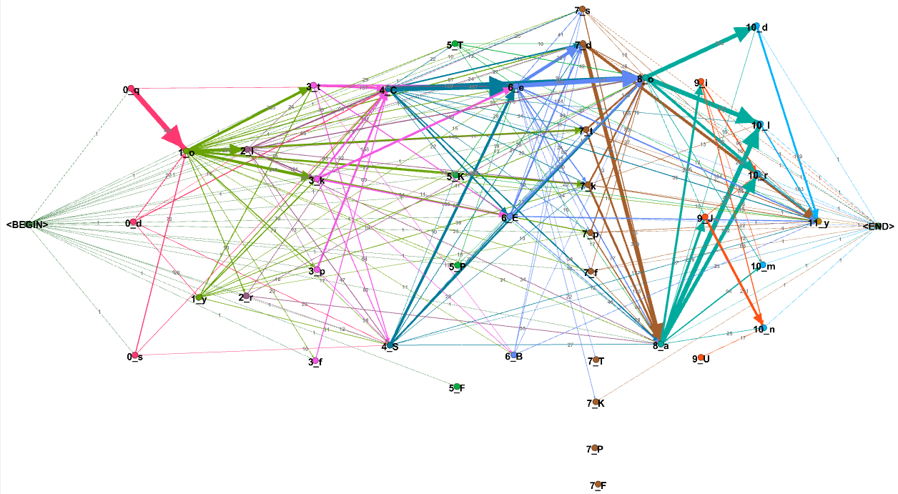

** To see the pictures properly, right click on them and open them in a different tab. **

# Analysis

Here i analyze char connections slot by slot.

LE IMMAGINI SONO DA RIFARE (E ANCHE QUALCHE CONCLUSIONE)

## Slot 0

Characters in slot 0 behave quite different one another.

'q' connects almost exclusively with 'o' in slot 1:

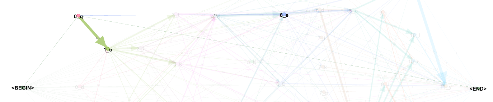

'd' connects with 'o' and 'y' in slot 1, 'l' in slot 2, or pedestals:

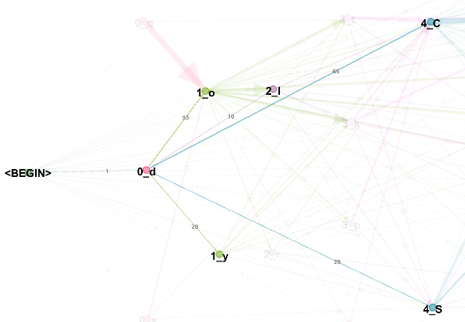

's' connects with 'o' in slot 1 or pedestals:

## Slot 1

'o' connects with any other character, with the exception of slots 9-10 (a common trait with all other characters as shown below):

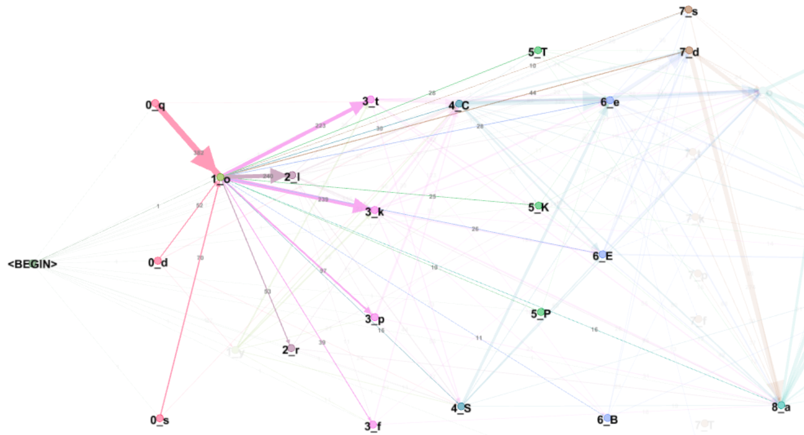

'y',  optionally preceded by a 'd', connects to gallows in slots 3 and 7, with pedestals (but NOT with pedestalled gallows) and less strongly with 'o'  in slot 8.

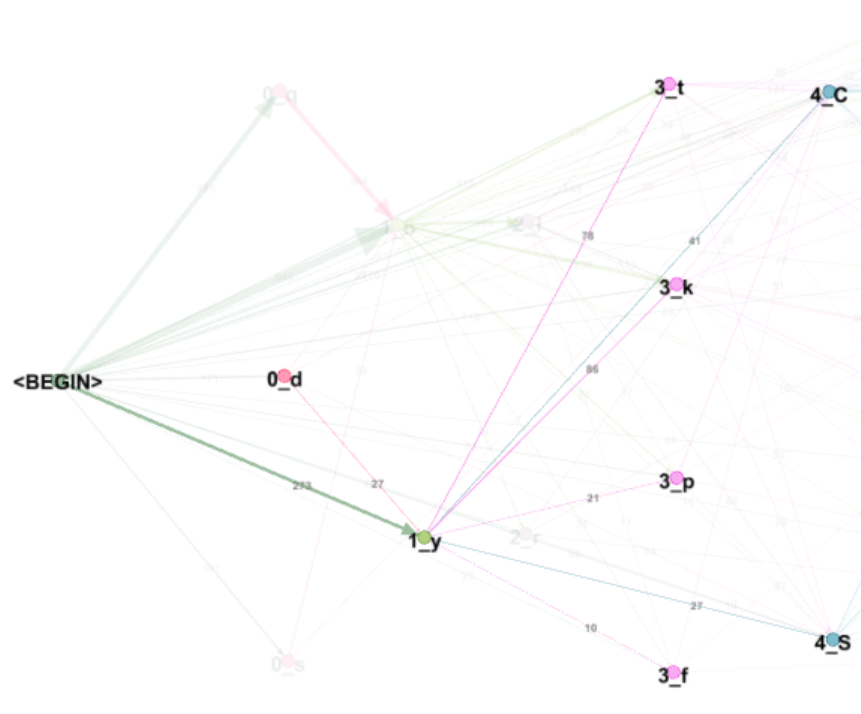

## Slot 2

'l' and 'r' here behave very differently.

'l', eventually preceded by 'o' or 'd', connects to gallows (both in slot 3 and 7), pedestals, 'E','s' or 'd' in slot 7, 'o' or 'a' in slot 8:

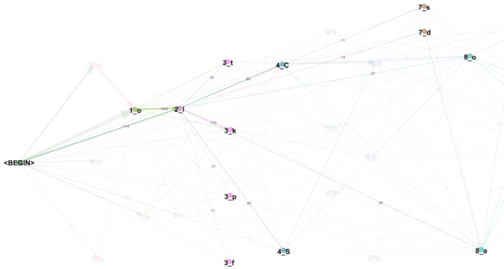

'r', can be eventually preceded by 'o' (but not by 'd'); in addition it connects only to pedestals, and 'o' or 'a' in slot 8, not to gallows:

## Slot 3

Gallows in slot 3 behave very similarly; they might be preceded by 'o', 'y', 'l' and are followed by a pedestal, or an 'e' sequence.

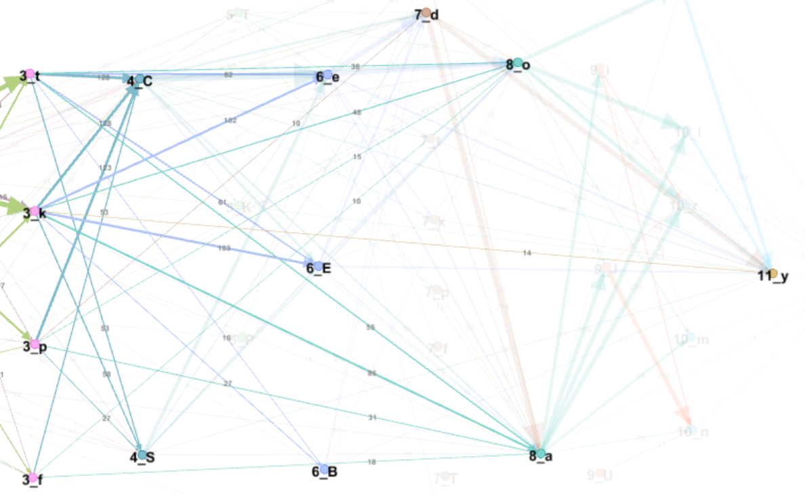

## Slot 4

Pedestals in slot 4 behave mostly the same, with the most noticeable difference difference that 'C' connects to 's' in slot 7 whereas 'S' does not:

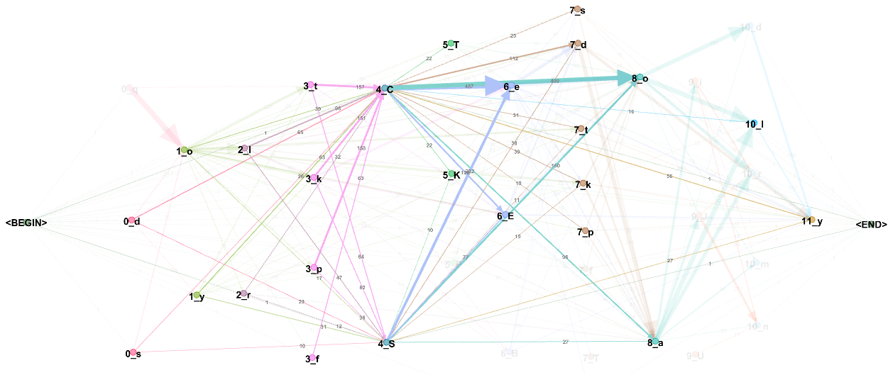

## Slot 5

Pedestalled gallows in slot 5 appear relatively seldom, they behaves in the same way.

They might be preceded by 'o' or by a pedestal and followed by 'e', 'd', 'a' or 'o' in slot 8 or the final 'y'

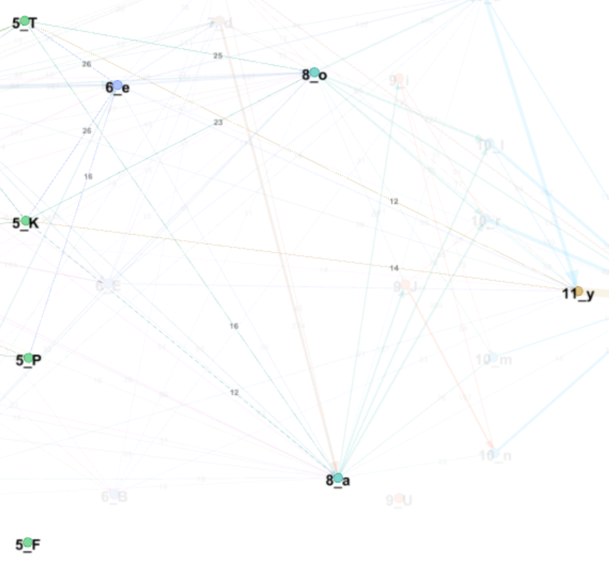

## Slot 6

Sequences of 'e' in slot 6 ('e', 'E', 'B') seem to behave in the same way.

They connect into next slots 7 and 8 or to the word final 'y'.

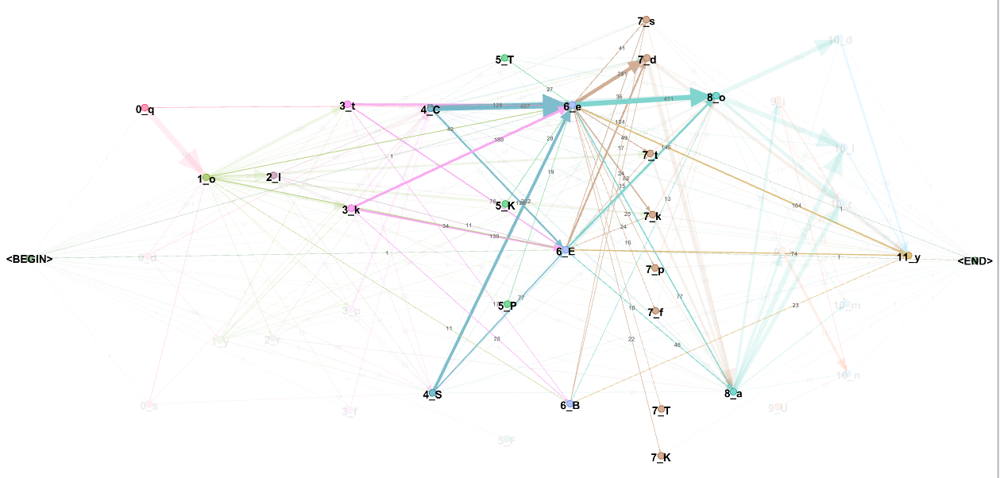

## Slot 7 

Characters in slot 7 are connected to slot 1, slot 2 (with the noticeable difference of 's', which almost never follows 'y' in slot 2), pedestals in slot 4 and 'e' sequences in slot 6. Notice they never connect to slots 0, 3 or 5. 

They are followed by 'o' and 'a' in slot 8 or the word ending 'y'. Notice 'd' followed by 'a' or 'y' is very common. 

Pedestalled gallows are in this slot, but they appear infrequently.

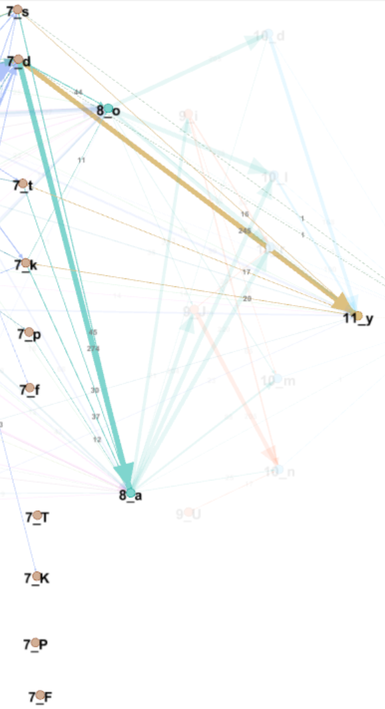

## Slot 8 

'o' and 'a' in slot 7 seem to act as a "bridge" between the previous slots and slots 9 ('i' sequences) and 10 ('d', 'l', 'm', and 'n');
where slots before 7 connects to slots 9-10 only through slot 8.

The main differences are:

* 'o' strongly connects to 'd' in slot 10, which 'a' does not.

* On the other side, 'a' has a strong tendency to be preceded by 'd' in slot 7, which almost never happen with 'o', which is mostly preceded by 'C' or 'e'.

* 'a' tends to be followed more often than 'o' by a sequence of 'i' in slot 9.

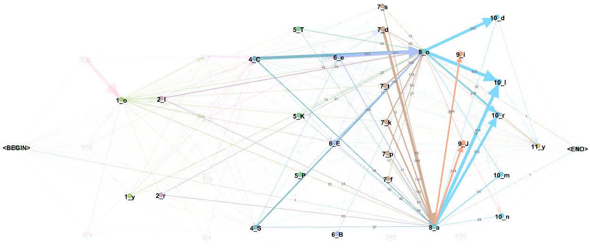

## Slot 9 

This slot contains sequences of 'i' ('i', 'J', 'U').

They are preceeded only by 'o' or 'a' in slot 8 and connect only to slot 10. Notice they are not followed by 'd' or 'l' in this slot.

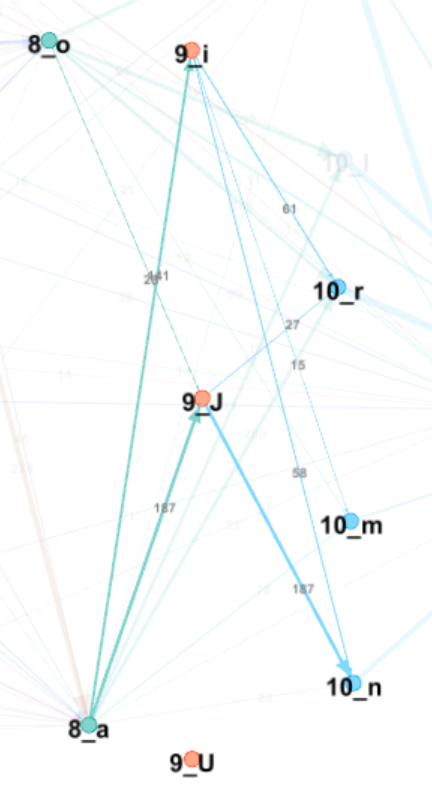

## Slot 10 

Letters here are preceeded by those in slots 8 and 9.

'd' is mostly preceded by 'o' and optionally followed by a word ending 'y'.

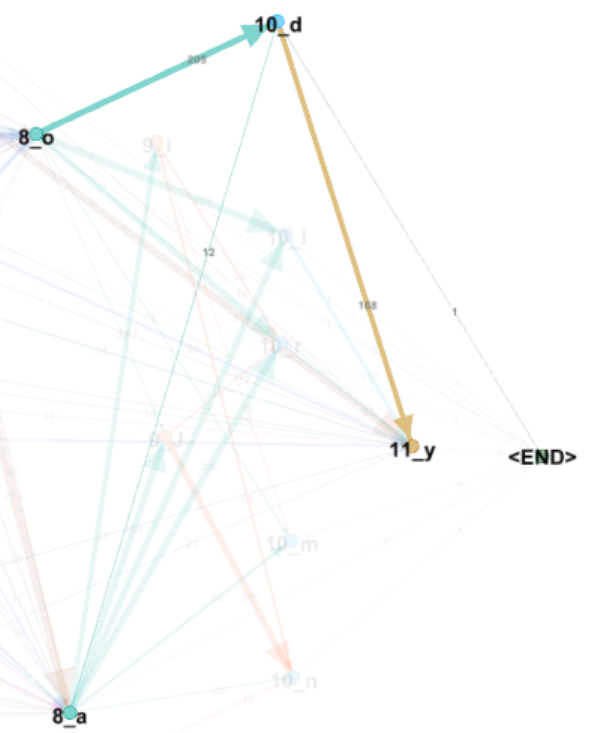

'l', 'r', 'm', 'n' can be preceded by 'o', 'a' (slot 8) or an 'i' sequence (slot 9).

Noticeable difference is that, while 'l' and 'r' can be followed by the word final 'y'...

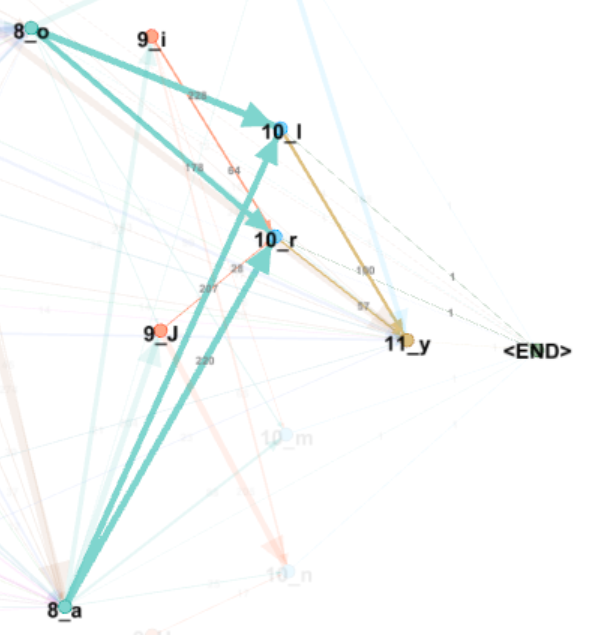

..., 'm' and 'n' are mostly word ending.

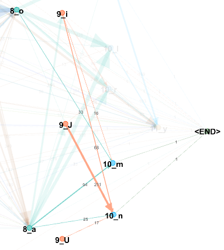

## Slot 11

This slot contains the word ending 'y' alone.

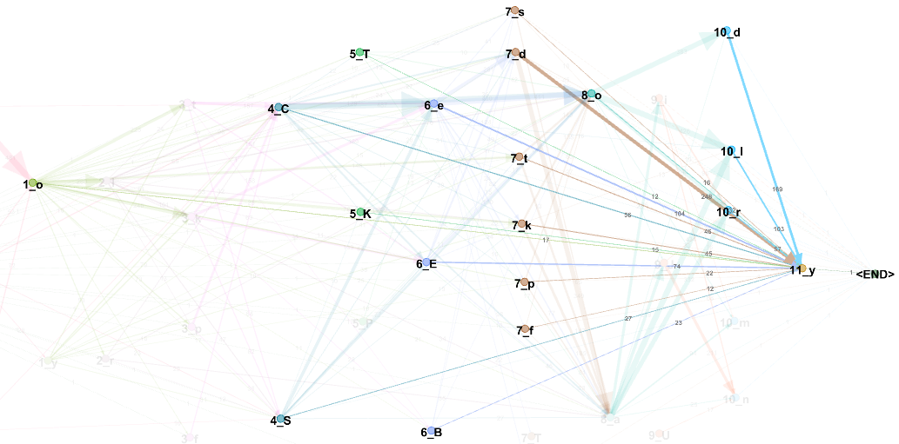

---

[**<< Home**](..)

Copyright Massimiliano Zattera.

 This work is licensed under a <a rel="license" href="http://creativecommons.org/licenses/by-nc-sa/4.0/">Creative Commons Attribution-NonCommercial-ShareAlike 4.0 International License</a>.
