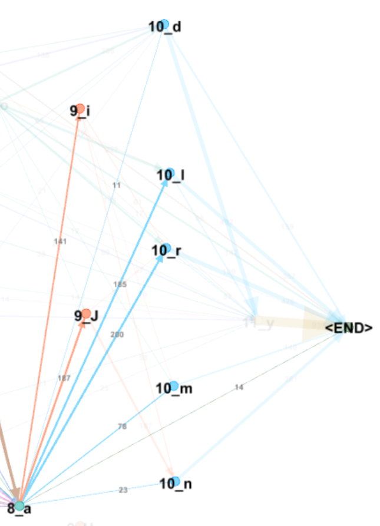
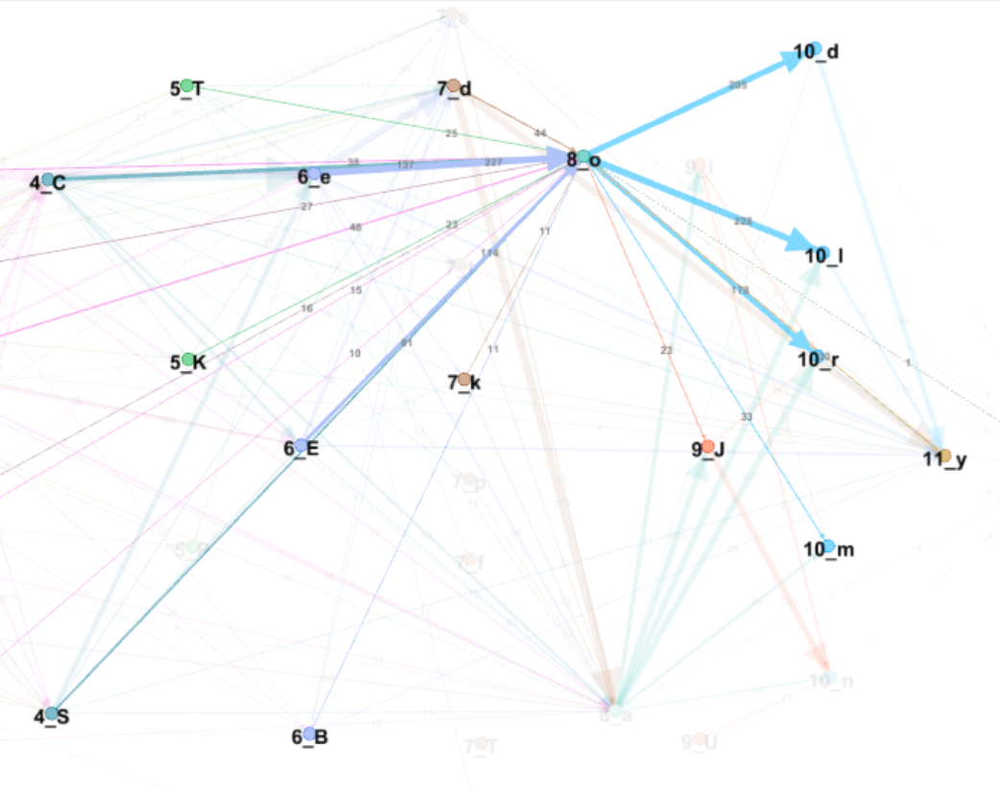

# Note 007 - A Graph View on Word Structure

_Last updated Jan. 16th, 2021._

_This note refers to [release v.8.0.0](https://github.com/mzattera/v4j/tree/v.8.0.0) of v4j;
**links to classes and files refer to this release**; files might have been changed, deleted or moved in the current master branch.
In addition, some of this note content might have become obsolete in more recent versions of the library._

_Working notes are not providing detailed description of algorithms and classes used; for this, please refer to the 
library code and JavaDoc._

_Please refer to the [home page](..) for a set of definitions that might be relevant for this working note._

[**<< Home**](..)

---

**Unless differently noted, this pages uses the Slot alphabet to transliterate Voynich words.**

**To see the pictures properly, right click on them and open them in a different tab.**

# Abstract

In this note, I create and analyze a graph showing connections between characters in Voynich terms accordingly to my [slot model](../005) [{1}](#Note1).
 

# Methodology

I created a graph where nodes are characters in their slots; e.g. "1_o" represent character 'o' in slot number 1. 

After that, I connected node A with node B if there is a regular term in the Voynich where character B follows directly character A;
the connection is a directed edge with a weight equal the number of terms where the characters are connected.
For visualization purposes I remove all edges with a weight less than 10 [{2}](#Note2). 

The resulting graph is shown below and commented further.

# Analysis

Here i analyze char connections slot by slot.

## Slot 0

Characters in slot 0 behave quite different one another.

'q' connects almost exclusively with 'o' in slot 1:

'd' connects with 'o' and 'y' in slot 1 or pedestals:

's' connects with 'o' in slot 1 or 'C' (pedestal):

## Slot 1

'o' connects basically with any other character up to slot 8; it seems to be the most "connected" character:

'y',  optionally preceded by a 'd', connects to gallows in slots 3, pedestals (but NOT with pedestalled gallows) and less strongly with 'd'  in slot 7:

## Slot 2

'l' and 'r' here behave very differently.

'l', eventually preceded by 'o', connects to gallows (both in slot 3), pedestals, 's' or 'd' in slot 7, and 'o' or 'a' in slot 8:

'r', eventually preceded by 'o', connects only to pedestals, and 'o' or 'a' in slot 8, not to gallows or slot 7:

## Slot 3

Gallows in slot 3 behave very similarly; they might be preceded by 'o', 'y', 'l' and are followed by a pedestal, an 'e' sequence, or  'o' and 'a' in slot 8.
'k' also link to the ending 'y' in slot 11, while 'p' links to 'd' in slot 7; these links are less marked though:

## Slot 4

Pedestals in slot 4 behave in slightly different ways.

As mentioned, they are preceded by same letters, with the exception that 'C' can be preceded by 's', which does not happen with 'S'.

'S' connects to slots 6 ('e' sequences) or 8 ('a' and 'o') in addition to 'd' in slot 7 or final 'y' in slot 11:

In addition to the above connections, 'C' connects to pedestalled gallows in slot 5, gallows and 's' in slot 7:

## Slot 5

Pedestalled gallows in slot 5 appear relatively seldom, they behaves in the same way.

They might be preceded by 'o' or 'C' and followed by 'e', 'd', 'a' or 'o' in slot 8, or the final 'y' in slot 11:

## Slot 6

Sequences of 'e' in slot 6 ('e', 'E', 'B') seem to behave in the same way.

They connect into next slots 7 and 8 or to the word final 'y'.

## Slot 7 

Characters in slot 7 are followed by 'o' and 'a' in slot 8 or the word ending 'y'. Notice 'd' followed by 'a' or 'y' is very common. 

Pedestalled gallows are present in this slot, but they appear very infrequently.

## Slot 8 

'o' and 'a' in slot 7 seem to act as a "bridge" between the previous slots and slots 9 ('i' sequences) and 10 ('d', 'l', 'm', and 'n');
where slots before 7 connects to slots 9-10 only through slot 8.

The main differences are:

* 'a' has a strong tendency to be preceded by 'd' in slot 7, which almost never happen with 'o', which is mostly preceded by 'C' or 'e'.

* 'o' strongly connects to 'd' in slot 10, which 'a' does not.

* 'a' tends to be followed more often than 'o' by 'i' or 'J', while 'o' tends to connect more directly with letters in slot 10 (and less 
often with the final 'y').

'a' behavior:

'o' behavior:

## Slot 9 

This slot contains sequences of 'i' ('i', 'J', 'U').

They are preceded only by 'o' or 'a' in slot 8 and connect only to slot 10. Notice they are not followed by 'd' or 'l' in this slot.

## Slot 10 

Letters in slot 10 are preceded by those in slots 8 and 9.

'd' is mostly preceded by 'o' and optionally followed by a word ending 'y'.

'l', 'r', 'm', 'n' can be preceded by 'o', 'a' (slot 8) or an 'i' sequence (slot 9).

Noticeable difference is that, while 'l' and 'r' can be followed by the word final 'y'...

..., 'm' and 'n' are mostly word ending.

## Slot 11

This slot contains the word ending 'y' alone.

	
---

**Notes**

<a id="Note1">**{1}**</a> Class [`io.github.mzattera.v4j.applications.slot.BuildSlotStateMachine`]() was used to generate the graph,
that was then visualized using [Gephi](https://gephi.org/); the resulting Gephi workbench is stored [here]().

Please notice package [`io.github.mzattera.v4j.util.statemachine`]() provides classes to represent state machines, which are used by `BuildSlotStateMachine`.

<a id="Note2">**{2}**</a> Please notice that, as you can see 
from the [glyph count by slot](../005/#GliphCountImg), some glyphs appear in less than 1% of the terms, that means they will
have less than 28 total incoming connection, therefore they might look unconnected in this graph.

---

[**<< Home**](..)

Copyright Massimiliano Zattera.

 This work is licensed under a <a rel="license" href="http://creativecommons.org/licenses/by-nc-sa/4.0/">Creative Commons Attribution-NonCommercial-ShareAlike 4.0 International License</a>.
