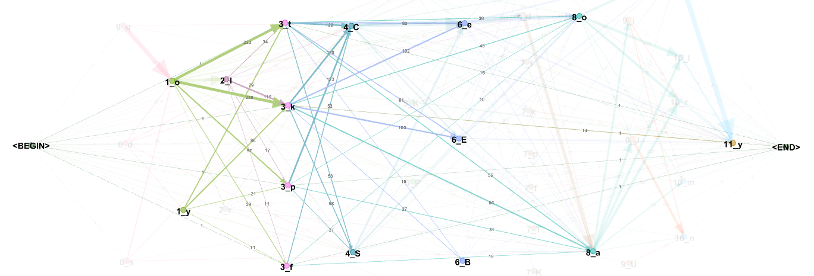
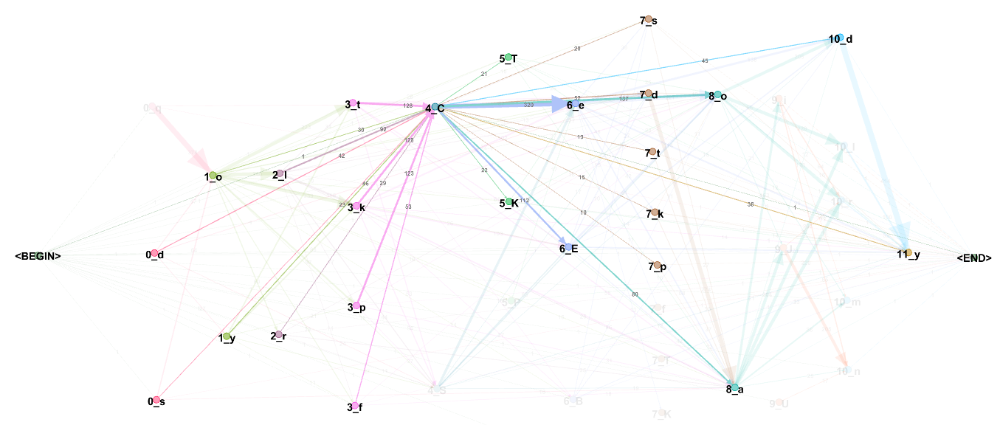
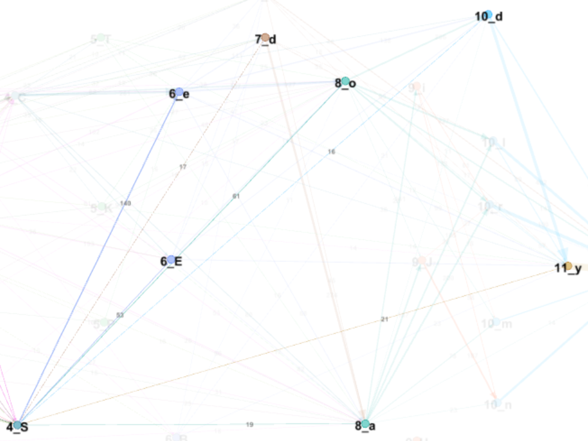

# Note 007 - A Graph View on Word Structure

_Last updated Oct. 24th, 2021._

_This note refers to [release v.5.0.0](https://github.com/mzattera/v4j/tree/v.5.0.0) of v4j;
**links to classes and files refer to this release**; files might have been changed, deleted or moved in the current master branch.
In addition, some of this note content might have become obsolete in more recent versions of the library._

_Working notes are not providing detailed description of algorithms and classes used; for this, please refer to the 
library code and JavaDoc._

_Please refer to the [home page](..) for a set of definitions that might be relevant for this working note._

[**<< Home**](..)

---

# Abstract

## Methodology

This work builds on my [slot model](../005) for Voynich words. 
** Unless differently noted, this pages uses the Slot alphabet to transliterate Voynich words. **

I created a graph where nodes are charters in their slots; e.g. "1_o" represent character 'o' in slot number 1.
After that I connected node A with node B if there is a regular term in the Voynich where character B follows directly character A;
the connection is a directed graph edge which weight is the number of terms where the characters are connected.
For visualization purposes I remove all edges with a weight less than 10.

Final note, when possible I push 'o' from slot 1 to 8, 'y' from slot 1 to 11, and 'y' from 0 to  7 to 10,
as this improves the graph (and might have implications with word structure as well.

The resulting graph is shown below and commented further.

# Analysis

Here i analyze char connections slot by slot.

## Slot 0

Characters in slot 0 behave quite different one another.

'q' connects mostly with 'o':

'd' connects with 'o' and 'y', pedestals or 'd' in slot 7:

's' connects with 'o', pedestal 'C' or 'a' in slot 8:

## Slot 1

'o' connects with most other characters:

'y' in slot 1 is optionally preceded by a 'd' and connects to gallows in slot 3 or pedestals in slot 4; notice it bypasses slot 2 completely:

## Slot 2

Characters here behave very differently.

'l', eventually preceded by 'o' connects to gallows, pedestals, 's' or 'd' in slot 7, 'o' or 'a' in slot 8:

'r', still eventually preceded by 'o' connects to pedestals, and 'o' or 'a' in slot 8:

## Slot 3

Gallows in slot 3 behaves in the same way; they might be preceded by 'o' or 'y' from slot 1, or 'l' from slot 2.
They are followed by a pedestal, an 'e' sequence in slot 6, 'o' or 'a' in slot 8.
'k' might additionally be followed by a word final 'y' in slot 11.

## Slot 4

Pedestals in slot 4 are preceded more or less by same characters but the do connect to a very different set of suffixes:

'C':

'S':

  
	
---

**Notes**

<a id="Note1">**{1}**</a> Personal communication, October 2021.

---

[**<< Home**](..)

Copyright Massimiliano Zattera.

 This work is licensed under a <a rel="license" href="http://creativecommons.org/licenses/by-nc-sa/4.0/">Creative Commons Attribution-NonCommercial-ShareAlike 4.0 International License</a>.
