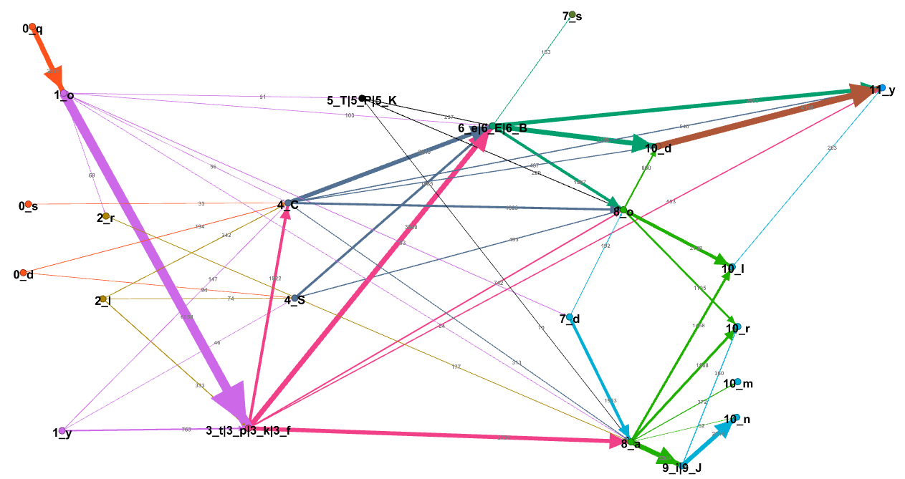
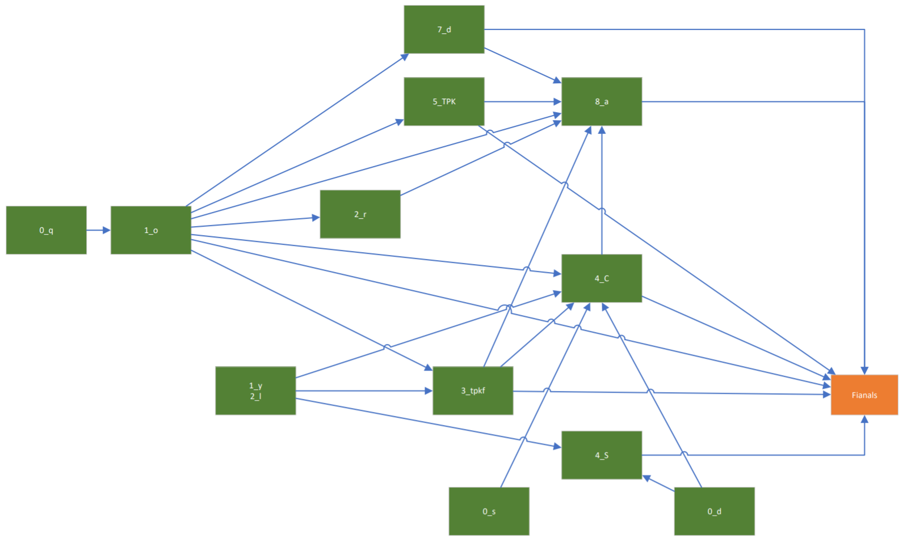
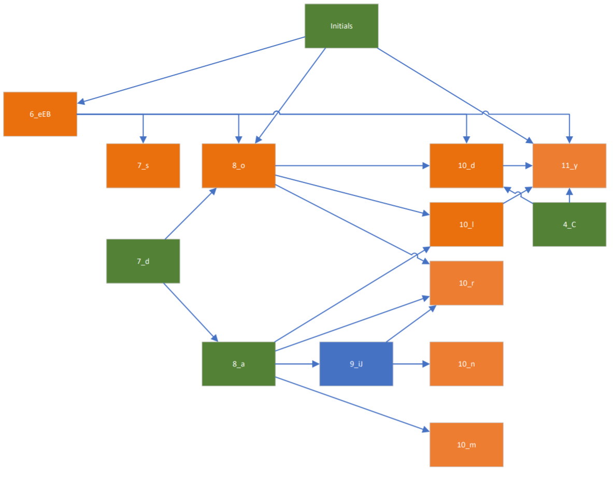

# Note 008 - Simply the Best Grammar for Voynichese :-)

_Last updated Feb. 22nd, 2022._

**_This note is part of my article I presented at the International Conference on the Voynich Manuscript 2022 [ZATTERA (2022)](../biblio)._**

_This note refers to [release v.9.0.0](https://github.com/mzattera/v4j/tree/v.9.0.0) of v4j;
**links to classes and files refer to this release**; files might have been changed, deleted or moved in the current master branch.
In addition, some of this note content might have become obsolete in more recent versions of the library._

_Working notes are not providing detailed description of algorithms and classes used; for this, please refer to the 
library code and JavaDoc._

_Please refer to the [home page](..) for a set of definitions that might be relevant for this working note._

[**<< Home**](..)

---


# Abstract

Following the work described in [Note 005](../005) and [Note 007](../007), I created a grammar for words in the Voynich.
This grammar covers almost two thirds of tokens (62% of tokens, or 21.6% of word types) in the concordance version of the manuscript. Moreover, it
is the best grammar created so far accordingly to the F1 score, a standard measure widely adopted to quantify performance of classifiers.

In this note, I use the word types "model", "graph", "grammar", "state machine", and "classifier" more or less interchangeably to indicate a representation of the inner structure of Voynich words,
as it is typically possible to move from one representation to an equivalent one (e.g. from a formal grammar to the equivalent state machine, to the graph depicting the machine,
 and all those can be viewed as classifiers, as explained below).

 
# Methodology

I wrote some code [{1}](#Note1) that, starting from the list of word types in the concordance version of the Voynich (see [Note 001](../001)), creates a state machine to model them. The best version I found is described by the below grammar [{2}](#Note2).

The notation:

```
S:
	a,b -> X,Y
```

means that when the machine is in state S, it can emit any of the two strings a or b and then enters in any of the two states X or Y. If we start from the initial state (`<BEGIN>`)
and follow the evolution of the state machine through all possible paths ending with the final state (`<END>`) we will generate all the word types this model defines as word types in the Voynich.
Of course, this list does not match exactly the list of word types in the Voynich (that is, the Voynich vocabulary); how good this match is, it is discussed in the below sections of this note.

```
<BEGIN>:
	 -> 0_d, 0_q, 0_s, 1_o, 1_y, 2_l, 2_r,
	    3_tpkf, 4_C, 4_S, 5_TPK, 7_d, 8_a

0_d:
	d ->     4_C, 4_S
0_q:
	q -> 1_o
0_s:
	s ->     4_C

1_o:
	o -> 2_r, 3_tpkf, 4_C,     5_TPK, 6_eEB, 7_d, 8_a
1_y:
	y ->      3_tpkf, 4_C, 4_S

2_l:
	l -> 3_tpkf, 4_C, 4_S
2_r:
	r ->                  8_a

3_tpkf:
	t, p, k, f -> 4_C, 6_eEB, 8_a, 8_o, 11_y

4_C:
	ch -> 6_eEB, 8_a, 8_o, 10_d, 11_y
4_S:
	sh -> 6_eEB,      8_o

5_TPK:
	cth, cph, ckh -> 6_eEB, 8_a, 8_o

6_eEB:
	e, ee, eee -> 7_s, 8_o, 10_d, 11_y, <END>

7_d:
	d -> 8_a, 8_o
7_s:
	s ->          <END>

8_a:
	a -> 9_iJ,       10_l, 10_m, 10_n, 10_r
8_o:
	o ->       10_d, 10_l,             10_r, <END>

9_iJ:
	i, ii -> 10_n, 10_r

10_d:
	d -> 11_y, <END>
10_l:
	l -> 11_y, <END>
10_m:
	m ->       <END>
10_n:
	n ->       <END>
10_r:
	r ->       <END>
	
11_y:
	y -> <END>

<END>:
```

The state machine is also depicted below [{3}](#Note3) (`<BEGIN>` and `<END>` state omitted for clarity).
Nodes are named after the letter they represent (as explained in [Note 007](../007)), weights on edges show how many tokens in the Voynich contain any given sequence of characters.



In an attempt to make the above picture and the state machine a bit easier to understand, I have created two diagram where I split the characters between "initials", which can appear 
at the beginning of words and that are shown in green, and "finals" that can appear at the end of a word and are shown in orange.





# Comparison with other works - Classifiers 

As discussed in [Note 006](../006), several models for the inner structure of Voynich word types have been created. The purpose of these models is to provide a description
of such structure in a way that provides some insights (e.g. show that a particular sequence of character is often used). In this process, it is necessary
for any model to operate some choices and simplifications in order to highlight what looks like a common pattern disregarding what seems more a "special case".
How can we evaluate how good a model is? How well does it describe Voynich word types, without indulging too much in useless details and exceptions?

An answer to this question comes from the theory of [classifiers](https://en.wikipedia.org/wiki/Classifier_(machine_learning)). We can look at each model as a tool that given a word in Voynichese can tell whether the 
word is a true Voynich word or not; this is done by looking at the set of word types a model can generate and classify a word type as a Voynich word type if it belongs to this set.
In this context, we can have 4 possible cases for each word type T we want to classify:

|  											| Word type T is generated by the model 	| Word type T is NOT generated by the model 	|
| :--- 	| :---: 	| :---: 	|
| Word type T appears in the Voynich 			| True Positive (TP)				| False Negative (FN) 					|
| Word type T does NOT appear in the Voynich 	| False Positive (FP)				| True Negative (TN) 					|


We can see a model is a good model if the number of true positives and true negatives is high whilst the number of false positives and false negatives is low (ideally 0).

We can define the **precision** of a model as the percentage of positives that are true positives; that is, the percentage of word types being generated by the model which do appear in the manuscript.
From the above table we can easily see that:

```
Precision = True Positives / All word types generated = TP / (TP + FP)
```

A model with precision = 1 (or 100%) will generate only words that appear in the Voynich; notice this does not mean it generates all of the Voynich word types.
Ideally, a model that generates only the word type 'daiin' has 100% precision, as all the word types it generates are true Voynich word types, but it ignores all of the other word types.

We can then define the **recall** of a model as the percentage of word types in the Voynich that are generated by the model. Again, from the above table we can easily see that:

```
Recall = True Positives / All word types in the Voynich = TP / (TP + FN)
```

A model with recall = 1 (or 100%) will generate all word types in the text, but it can generate many more that are not in the text.
Potentially, a model that generates all possible combinations of letters in the Voynich alphabet will generate all of the word types in the manuscript (recall=1), but will also generate a 
huge amount of words that are not in the Voynich (false positives).

You can see there is a tension between precision and recall; one can increase recall by having the model to generate more words, but this increases the risk of generating word types which are not Voynich word types (false positives), thus reducing precision. There is a need of a single number that represents a compromise between best recall and best precision; in the 
theory of classifiers this number is called **F1 score** and is defined as:

```
F1 = 2 * precision * recall / (precision + recall)
```

You can see F1 score tends to 0 if either precision or recall tend to 0, while it tends to 1 if both recall and precision tend to 1.

The table below compares our grammar with other models described in [Note 006](../006), providing their precision, accuracy and F1 score [{4}](#Note4).

 "Generated Strings" is the number of strings a model generates. "Positive Tokens" is the percentage of tokens in the Voynich that the model recognizes.
 
| Model 	| Generated Strings 	| True Positives 	| Positive Tokens 	| Precision 	| Recall 	| F1 Score |
| :--- 	| ---: 	| ---: 	| ---: 	| ---: 	| ---: 	| ---: |
| ROE 	| 120	| 112	| 15.954%	| <span style="color:red">0.933</span>	| 0.022	| 0.043 |
| STOLFI 	| 143'124'560'075'240'080'000	| 4'527	| <span style="color:red">97.813%</span>	| 0.000	| <span style="color:red">0.881</span>	| 0.000 |
| NEAL_1a 	| 87'480	| 535	| 20.083%	| 0.006	| 0.104	| 0.012 |
| NEAL_1b 	| 174'818	| 1'782	| <span style="color:orange">66.013%</span>	| 0.010	| 0.347	| 0.020 |
| NEAL_2 	| 1'311'345	| 1'049	| 45.248%	| 0.001	| 0.204	| 0.002 |
| PALMER 	| ∞	| 4'547	| <span style="color:red">97.280%</span>	| 0.000	| <span style="color:red">0.884</span>	| 0.000 |
| VOGT (Recipes) 	| 32'575	| 424	| 58.697%	| 0.013	| 0.190	| 0.024 |
| VOGT 	| 32'575	| 565	| <span style="color:orange">55.734%</span>	| 0.017	| 0.110	| 0.030 |
| PELLING 	| ∞	| 259	| 32.099%	| 0.000	| 0.050	| 0.000 |
| PELLING_2 	| 1'192	| 259	| 32.099%	| 0.217	| 0.050	| 0.081 |
| SLOT 	| 4'643'467	| 2'617	| <span style="color:red">86.447%</span>	| 0.001	| <span style="color:orange">0.509</span>	| 0.001 |
| <span style="color:green">**SLOT MACHINE**</span> 	| 3'110	| 1'113	| <span style="color:orange">62.040%</span>	| <span style="color:orange">0.358</span>	| 0.216	| <span style="color:red">0.270</span> |

  - **STOLFI**: Jorge Stolfi's "crust-mantle-core" model. As it is impossible to generate and test all words for this model, I assume any word type in the Voynich that is not listed in Solfi's `AbnormalWord` is a true positive.
  - There are three versions of grammars described by Philip Neal:
    - **NEAL_1a**: the version from Voynich Ninja forums.
    - **NEAL_1b**: same as above, with `[d]` replaced by `[d_]` (not sure whether this was intended by the author).
    - **NEAL_2**: version from Cypher Mysteries.
  - When interpreting [Palmer's model](http://ciphermysteries.com/2010/11/22/sean-palmers-voynichese-word-generator) I assume the standard notation for sequences of characters in regular expressions
  (* = zero or more, + = one or more, ? = zero or one).
  - Vogt's model was created only for the "recipes" section (Stars section, language B); here a comparison is provided both limited to that section and for the entire text.
  - When implementing Pelling's state machine, I assumed all arrows have the same meaning (even if some are dashed) and the red boxes are non-emitting states.
    - The author claims the model should generate about 1'200 word types, but in my interpretation a loop in "Column 3" makes this generate a potentially infinite number of word types. **PELLING_2** shows the calculations assuming the model generates only 1'192 strings.
  - **SLOT** considers all word types generated by the [Slot model](../005).
  - **SLOT MACHINE** Is the state machine I describe above in this note.

  
# Conclusions

  - The proposed grammar has the best F1 score, an order of magnitude above any other model I know. It is able to 
  model 62% of tokens that appear in the Voynich (that is 1'113 word types, or 21.6% of them).
  - The proposed grammar has the second best precision, topped only by Roe's model, which generates only 120 words (and 112 word types of the Voynich).
  - Models with a recall higher than the proposed grammar (Stolfi's, Palmer's, and my Slot model) generate an almost infinite number of words.
  If we ignore these, Neal's model (NEAL_1b) has a higher recall than the proposed one, but generates more than 170'000 words, compared to the only 3'000 generated by my model. 
  
	
---

**Notes**

<a id="Note1">**{1}**</a> Class [`BuildSlotStateMachine`](https://github.com/mzattera/v4j/blob/v.9.0.0/eclipse/io.github.mzattera.v4j-apps/src/main/java/io/github/mzattera/v4j/applications/slot/BuildSlotStateMachine.java) was used for
this purpose. It provides means to generate and evaluate state machines and output them in different formats, including a grammar description and Java code to be used with the v4j library.

<a id="Note2">**{2}**</a> A parameter `BuildSlotStateMachine` requires is the minimum amount of word types using an edge of the state machine to keep the edge alive (that is, the minimum number of word types containing a specific sequence of two characters). For the machine in this note, I used a minimum weight of 10.
A machine with higher F1 score (TP=1'194, Precision=0.371, Recall=0.232, F1=0.286)  can be created using a minimum weight of 5; its grammar is described in 
[StateMachine05_grammar.txt](https://github.com/mzattera/v4j/blob/v.9.0.0/resources/analysis/slots/StateMachine05_grammar.txt) and a graphical representation suitable for [Gephi](https://gephi.org/) can be found in `StateMachine05.gephi` in [same folder](https://github.com/mzattera/v4j/blob/v.9.0.0/resources/analysis/slots/).
I this discussion, I am ignoring it, as it is also slightly more complex that the one presented here.

<a id="Note3">**{3}**</a> A version of this graph that can be visualized using [Gephi](https://gephi.org/) (`StateMachine10.gephi`) is stored [here](https://github.com/mzattera/v4j/blob/v.9.0.0/resources/analysis/slots/).

<a id="Note4">**{4}**</a> Class [`WordModelEvaluator`](https://github.com/mzattera/v4j/blob/v.9.0.0/eclipse/io.github.mzattera.v4j-apps/src/main/java/io/github/mzattera/v4j/applications/slot/WordModelEvaluator.java) was used 
to create this table.

---

[**<< Home**](..)

Copyright Massimiliano Zattera.

<a rel="license" href="http://creativecommons.org/licenses/by-nc-sa/4.0/"></a><br />This work is licensed under a <a rel="license" href="http://creativecommons.org/licenses/by-nc-sa/4.0/">Creative Commons Attribution-NonCommercial-ShareAlike 4.0 International License</a>.
