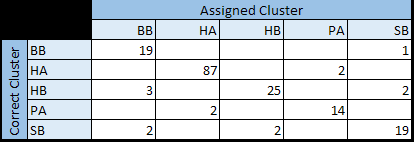
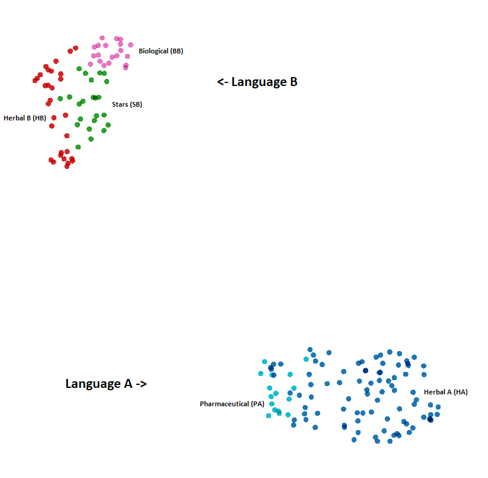

# Note 009 - The Five Languages of the Voynich

_Last updated Sep. 18th, 2022._

**_This note is part of my article I presented at the International Conference on the Voynich Manuscript 2022 [ZATTERA (2022)](../biblio)._**

_This note refers to [release v.11.0.0](https://github.com/mzattera/v4j/tree/v.11.0.0) of v4j;
**links to classes and files refer to this release**; files might have been changed, deleted or moved in the current master branch.
In addition, some of this note content might have become obsolete in more recent versions of the library._

_Working notes are not providing detailed description of algorithms and classes used; for this, please refer to the 
library code and JavaDoc._

_Please refer to the [home page](..) for a set of definitions that might be relevant for this working note._

[**<< Home**](..)

---


# Abstract

In this note, I show evidence of structural differences in words appearing in the 5 main clusters (see [note 003](../003)) of the Voynich,
suggesting that the two Currier's languages A and B (see [CURRIER (1976)](../biblio.md)) are probably only a major distinction in a bigger group of such "languages".
I also argue how these languages might be the result of different "parametrizations" of the cypher.


# Methodology

Building on the work done to create a grammar of Voynichese, as described in [note 008](../008), I used the same technique[{1}](#Note1) to create grammars for the 
different sections of the Voynich[{2}](#Note2).

The differences between each grammar and the grammar in note 008 were used to identify patterns in word structure that could characterize the different clusters.
For example, in the grammar for the SB cluster (and not in the one in note 008), the production rule 6_eEB can be generated from the initial rule,
meaning that sequences like 'e-', 'ee-', or 'eee-' at the beginning of words are a potentially distinctive feature of this cluster. 

Frequencies with which these patterns appear in each page are collected[{3}](#Note3) and fed into an algorithm 
to create a decision tree[{4}](#Note4) that classifies pages based on these patterns, which is shown below.


```
if <= 2% of tokens contain 'ed' then [ 

	- This is Currier's Language A -
	
	if > 14% of tokens contain 'eo' then [
		if > 4% of tokens begin with 'cth' [
			Cluster is HA
		] else [
			Cluster is PA
		]
	] else [
		Cluster is HA
	]
] else [ 

	- This is Currier's Language B -
	
	if any token contains 'so' then [
		if > 4% of tokens contain 'eo' then [
			Cluster is SB
		] else [
			Cluster is BB
		]
	] else [
		Cluster is HB
	]
]
```

Surprisingly, the resulting tree is very compact and manages to classify pages in the main clusters with a 92% accuracy (164 pages classified correctly, 14 classified in the wrong cluster)[{5}](#Note5),
as can be seen in the below confusion matrix.



As a test, the same pages have been assigned a random cluster out of possible 5, and the process has been repeated. The resulting decision tree contains 11 rules (instead of 6) and reaches only a 54%
accuracy, showing that structural features we found are indeed correlated with clusters we identified in note 003. As further confirmation,
the below picture is an UMAP projection of the pages, using the patterns as dimensions. As you can see, Currier's languages are clearly separated and pages in the same cluster group nicely together.



 
# Conclusions

The above results suggest that the difference between words in different clusters is not a
difference in vocabulary (e.g., the same difference between an English article about astronomy
compared to an article in botany), rather a difference in inner structure of the words (e.g., like words in
English, that often contain the sequence “th”, when compared to Italian words where this sequence is
not permitted). It can be an indication that the two Currier’s "languages" A and B are probably
only a major distinction within a group of (at least) five such "languages".

In [note 005](../005) I showed how the slot structure applies to the entire text; 
at the same time, the grammar in note 008 can generate about 62% of tokens in the whole manuscript, an indication that the
method used to create the text is somewhat uniform across the different clusters. On the
other side, the fact that clusters can be identified just looking at some character
sequences in words suggests that this general method has somehow been “tweaked” for each
section. One could speculate that the method used to create the text, whether it is an actual
cypher or a way to generate gibberish, relies on some parameters (e.g., a table, a grill) which
are made different for each cluster. This also suggests that any decipherment attempt, or
statistical analysis, should be conducted separately for each cluster.

Finally, the difference in word structure across the different clusters will obviously affect
the list of word types appearing in each section; in turn, this will affect any clustering
algorithm that uses words as features. The implication here is that previous works that used
clustering to support the idea of different topics in different sections, might be just surfacing
a difference which is the result of the mechanism used to generate words, and not
a difference in terminology in the plaintext. 

Again, these differences shows once more how analysis of the Voynich should be performed separately for each cluster.  
	
---

**Notes**

<a id="Note1">**{1}**</a> Class [`BuildSlotStateMachine`](https://github.com/mzattera/v4j/blob/v.11.0.0/eclipse/io.github.mzattera.v4j-apps/src/main/java/io/github/mzattera/v4j/applications/slot/BuildSlotStateMachine.java) was used for this purpose. Concordance version of the Voynich was used (Slot alphabet transcription).

<a id="Note2">**{2}**</a> A complete list of grammars for each section can be found [here](https://github.com/mzattera/v4j/tree/master/resources/analysis/grammar). The file `Grammars Comparison.docx` summarizes
the differences being found.

<a id="Note3">**{3}**</a> Class [`ExtractGrammaticalFeatures`](https://github.com/mzattera/v4j/blob/v.11.0.0/eclipse/io.github.mzattera.v4j-apps/src/main/java/io/github/mzattera/v4j/applications/slot/ExtractGrammaticalFeatures.java) was used for this purpose.
The analysis is conducted on the [Slot transcription](https://github.com/mzattera/v4j/blob/master/eclipse/io.github.mzattera.v4j/src/main/resources/Transcriptions/Interlinear_slot_ivtff_1.5.txt)
of the Voynich, considering the whole text, including unreadable words, and discarding those features appearing in less than 0.6% of tokens (meaning that, on average, they are unlikely to appear once on a page).
The result can be seen in file `Features.xlsx` saved [here](https://github.com/mzattera/v4j/tree/master/resources/analysis/grammar).
The file contains also a [summary](images/Features.PNG) showing the average % of the tokens exhibiting each feature in each cluster.

<a id="Note4">**{4}**</a> [This folder](https://github.com/mzattera/v4j/tree/v.11.0.0/KNIME/Word%20Structure%20Clustering) contains the KNIME workspace with the workflow used to create the decision tree.

<a id="Note5">**{5}**</a> Class [`DecisionTreeTest`](https://github.com/mzattera/v4j/blob/v.11.0.0/eclipse/io.github.mzattera.v4j-apps/src/main/java/io/github/mzattera/v4j/applications/slot/DecisionTreeTest.java)
was used to create these statistics. Its output can be seen in file `ClusterPrediction.xlsx` saved [here](https://github.com/mzattera/v4j/tree/master/resources/analysis/grammar).


---

[**<< Home**](..)

Copyright Massimiliano Zattera.

<a rel="license" href="http://creativecommons.org/licenses/by-nc-sa/4.0/"></a><br />This work is licensed under a <a rel="license" href="http://creativecommons.org/licenses/by-nc-sa/4.0/">Creative Commons Attribution-NonCommercial-ShareAlike 4.0 International License</a>.
