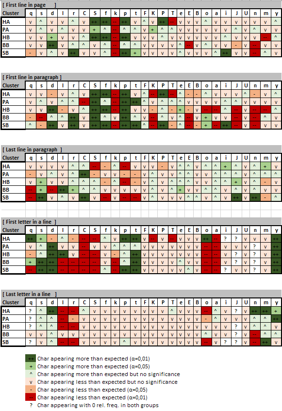

# Note 010 - Character distribution through the page

_Last updated Oct. 16th, 2022._

_This note refers to [release v.13.0.0](https://github.com/mzattera/v4j/tree/v.13.0.0) of v4j;
**links to classes and files refer to this release**; files might have been changed, deleted or moved in the current master branch.
In addition, some of this note content might have become obsolete in more recent versions of the library._

_Working notes are not providing detailed description of algorithms and classes used; for this, please refer to the 
library code and JavaDoc._

_Please refer to the [home page](..) for a set of definitions that might be relevant for this working note._

[**<< Home**](..)

---

[note 008](../008)

# Abstract

It is known since the very beginning of Voynich studies, that the distribution of character within the page presents some statistical anomalies.
This note looks into it, using for the first time the
[Slot transcription](https://github.com/mzattera/v4j/blob/master/eclipse/io.github.mzattera.v4j/src/main/resources/Transcriptions/Interlinear_slot_ivtff_1.5.txt).

**Unless differently indicated, the rest of this note uses the [Slot alphabet](../alphabet) when quoting Voynich text.** 
Please notice that lowercase letters represent same characters both in EVA and Slot alphabets; uppercase letters used in the Slot alphabet represent groups of
characters in EVA (e.g., 'qoCey' in Slot corresponds to 'qochey' in EVA).

# Methodology

In this note I will show the result of several experiments. In each experiment, the text of the Voynich is split into two parts,
for example first lines of every paragraph will form the first part of text, whilst the other lines are in the second part;
the character distribution of the two parts is compared using a chi-squared test, where each "bin " is a character.
If the test shows a statistically significant variation, then each character is tested individually (again, using a chi-squared test),
to highlight which characters behave differently in the two parts of the text.

In all experiments, a [concordance version](https://github.com/mzattera/v4j/blob/master/eclipse/io.github.mzattera.v4j/src/main/resources/Transcriptions/Interlinear_slot_ivtff_1.5.txt)
of the Voynich in the Slot alphabet is used; only text appearing in paragraphs is considered (IVTFF locus type = P0 or P1).
The experiments are done separately for each [cluster](../003);.

The set of experiments is as follows:

*** Ricontrolla che le definizioni qui sotto siano giuste ***

  * First line in page - first lines of pages are compared with the rest of the text.
  * First line in paragraph - first lines of paragraphs are compared with the rest of the text.
  * Last line in paragraph - last lines of paragraphs are compared with the rest of the text.
  * First letter in a line - initial character of first word in a line is compared with initial characters of all other words.
  * Last letter in a line - final character of last word in a line is compared with last characters of all other words.

*** FAI UN TEST DEL BINNING USATO PER I TEST ***
*** FAI UN TEST DEI METODI STATICI IN EXPERIMENTS (I TEST PER LE SINGOLE CLASSI ESISTONO) ***

The results are shown in the below table[{1}](#Note1)[{2}](#Note2):

** PRENDI L ULTIMA VERSIONE PE RLO SCREENSHOT **

As a test, experiments have been repeated with a shuffled version of the Voynich where the layouts has not been changed but words were shuffled around randomly
and the anomalies in distribution disappeared.
	 
# Considerations and Previous Works

## Character Distribution

** Maybe start with a simple table of char frequency by cluster **
  -> CountCharactersByCluster  -> Character frequencies by cluster is different
  -> CountVsTypesScatter -> Shows how distribution in clusters by token/type is different

 * [D'IMPERIO (1978b)](../biblio.md)
  One example (of char statistics) is found in D'Imperio (1978) (see note 4), Fig. 28 on p.106, from several sources but none covering the entire MS text.

## Lenght & Interesting

Here or in another note study lenght and number of intersting words.
For interesting words, add also "last line of paragraph" to the study, similar to what we did with last word....count from the end.

## Removing Characters from beginning of Words

In previous works about character distribution, one theory or another has been pitched by claiming something like:
"character X appears in this place, but if we remove it, we obtain another word that appears somewhere else in the Voynich".

I want to re-state here what I said already at the end of [Note 005](../005). Because of the "slot"  structure of Voynich words,
removing a character in a word (that is, emptying a slot), has good chances to produce a valid word.
If you remove a character from a random common word (appearing at least 5 times in the Voynich), 9 times in 10 you will end up with a word that also appears somewhere else in the text.
Doing this for a random character in a word creates  2 out of 3 times a word that appears somewhere else.

This criteria, though if it might make some sense, should thus taken with a grain of salt.

## The Line is a Functional Entity

[CURRIER (1976)](../biblio.md) advocated the idea of the line, when the text is running linearly, being a "functional entity":
"These three findings have convinced me that the line is a functional entity, (what its function is, I don’t know), 
and that the occurrence of certain symbols is governed by the position of a ‘word’ in a line":

  1. "The frequency counts of the beginnings and endings of lines are markedly different from the counts of the same characters internally".

  2. "The ends of the lines contain what seem to be, in many cases, meaningless symbols:
	little groups of letters which don’t occur anywhere else, and just look as if they were
	added to fill out the line to the margin".
	
  3. "In \[the herbal material and of the biological material\] ... there is not one single case of a repeat going over the end of a line to
	the beginning of the next".

The first point, is the topic of this note.

The second point hasn't been picked up by any author I know. A quick test shows no indication that words get shorter towards the end of a line.
Something to be investigated further.

On the third point I could find only the below exceptions in the majority version of the Slot transcription[{3}](#Note3); whether they are problematic, I leave it for another time.

  * Herbal A
    * 'daJn' on f35v.16-17, f87r.13-14, f90r2.5-6
  * Biological
    * 'dar' f84r.22-23
    * 'qol' on f78v.22-23
    * 'qokaJn' on f82r.3-4 
    * 'qokEdy' on f84r.39-40 
  * 'qokaJn' on f86v6.42-43 (Text page in the Rosetta quire)

	
## First Line in a Page

The distribution of characters in the first line of a page seems to follow the same patterns shown by characters appearing in first line of a paragraph.
For the time being, I will assume that the differences between first line of a page and first line in a paragraph are only due to the fact that,
being the sample much smaller for beginning of pages, the trends are just less marked.

## First Line in a Paragraph

Words starting with non-pedestalled gallows are almost always found as first word in a paragraph.
Words starting with pedestalled gallows are more rare and distributed more or less evenly, but tend not to appear at the beginning of a line other than first line of paragraphs.

75-95% of first words in paragraphs start with a (pedestalled) gallows.

p, f, P, F appear almost exclusively in first line of a paragraph; p and f, when appearing in the first word; are almost always initials.

Other (pedestalled) gallows tend to not appear as word initials.

[TILTMAN (1967)](../biblio.md) Paragraphs nearly always begin with gallows, most commonly 'f' or 'p',
which also occur frequently in words in the top lines of paragraphs where there is some extra space (c).
 
[CURRIER (1976)](../biblio.md)
  * 'p' & 'f' appear 90-95% of the time in the first lines of paragraphs, in some 400 occurrences in one section of the manuscript.
 
[CURRIER (1976)](../biblio.md)
  * The 'ligatures' [ cKh cTh cFh cPh ] can never occur as paragraph initial, and almost never line initial.

[D'IMPERIO (1978b)](../biblio.md)
The split gallows seem only to occur on first lines of paragraphs, and in labels. -> NON SO DA DOVE ARRIVA
forse e' na roba di Grove? (vedi sotto)

[D'IMPERIO (1978b)](../biblio.md)
Pag, 28 4.4.1
14) On most herbal folios the first line of the first paragraph begins with a very small set of symbols,
    primarily 't', 'k', 'p', 'f', these are usually immediately followed by 'ch', 'sh', 'o', 'y'.

** This MIGHT ** be the definition of Grove words? http://voynich.net/Arch/2004/09/msg00478.html it also provide some rules on Gallows.
Gallows are very problematic because:
		F and P are first line of paragraph dependant (out on the limb - about 95%
of them);
		First Gallows on a page can normally be detached from the first word to
form a relatively normal VMS word;
		Split Gallows are quite rare - but do appear as labels or first words on a
page;
		K and T word patterns are very similar okedy otedy;
		Add the ch versions and we now have 8 Gallows plus Split-Gallows;
		The same first line of paragraph dependancy shows on cph and cfh as well.

	I can't see how f,p, cph(iph), cfh(ifh) can be part of some coding scheme
since they are so dependant on first line of a paragraph (unless the whole
first line is setting up a cipher for the rest of the paragraph).  -> ESATTAMENTE IL MIO PUNTO, DA CITARE
No...another reference here: http://voynich.net/Arch/2004/09/msg00442.html	(STOLFI TALKING ABOUT GROVE WORDS)	
The graphs are new, but the explanation for those peaks in the
line-sorted graph may be a discovery that John Grove made several
years ago: on many lines, the first word looks like a "normal" word
with an extra gallows attached at the beginning.
IIRC, the evidence that those initial gallows are not really part of
the word includes: (1) many of those words are fairly rare, but if one
removes those "detachable gallows" (as John called them), one often
obtains a relatively common word. (2) words that start with a gallows
letter are more common at the beginning of lines than elsewhere; (3)
those words often have two gallows, which is a fairly rare feature of
Voynichese words.
About item (3): to be precise, in some trenscription of the VMS there
are ~930 tokens (in 35,000, or 2.6%) that do not fit my word grammar
because they violate the three-layer (crust-mantle-core-mantle-crust)
rule. Most of these words occur only once in the text. Of those ~930
tokens, ~210 look like Grove words in that they start with a gallows,
and by removing that gallows one obtains a word that fits my word
grammar. (Most of the remaining ~720 anomalies could be pairs of words
that were run together) -> SEPARABLE WORDS???
I have not checked whether those ~210 "Grove-like" tokens occur at the
beginning of lines or not. They seem to occur at about the same rate
in most sections, but twice as often in Biological, and hardly at all
in Astro/Cosmo. None of them occur as labels.
The big question is what the Grove Words mean. Apart from
cryptographic devices, they could be separators (like the reversed "P"
sign that scribes used to separate paragraphs). Or they could be tags
indicating "fields" in a "form", e.g.

  * Stolfi: https://www.ic.unicamp.br/~stolfi/EXPORT/projects/voynich/00-06-07-word-grammar/#ref4 :
    The paradigm also provides strong support for John Grove's theory that many ordinary-looking words occur prefixed with a spurious "gallows" letter
	(k t p f in the EVA alphabet). => THIS IS THE CASE IN FIRST LINE

[BOWERN (2020)](../biblio.md)
The clearest example of this phenomenon is the paragraph, which usually begins with a
gallows character. 85% of the paragraphs in the text begin with one of t, k, f, p. These
“gallows-initial” words are (1) otherwise fairly infrequent; and (2) have the same structure as
normal Voynich words except that they are preceded by a gallows character. John Grove first
hypothesized that gallows-initial words were variants of other words
Furthermore gallows-initial words, when they do appear elsewhere, 
usually begin with k k or f f rather than p p or t t. <- sbagliato

[ZANDBERGEN (2021)](../biblio.md)
The first is that the first word in each paragraph typically starts with a character from a very small group,
and this character seems to have been pre-fixed to this word. This character is often written larger than
the other characters on the page, and if this character is removed, a regular Voynich word appears, at
least in most cases. These words play a special role in Stolfi’s word grammar, because they usually don’t
fit the grammar, when the extra character is included.

[ZANDBERGEN (2021)](../biblio.md)
The second feature is a much more serious one. This is that the characters f and p , and also cFh and
cPh , tend to appear only in top lines of paragraphs. Furthermore, this is not a very hard rule – they do
appear elsewhere too, but the predominance in top lines of paragraphs is very strong. T 

## Last Line in a Paragraph

## First Letter in a Line

[TILTMAN (1967)](../biblio.md) 'y' occurs quite frequently as the initial symbol of a line followed immediately by a combination of symbols which seem
to be happy without it in any part of a line away from the beginning (d).
  
[CURRIER (1976)](../biblio.md)
  * The 'ligatures' [ cKh cTh cFh cPh ] can never occur as paragraph initial, and almost never line initial.
  
[CURRIER (1976)](../biblio.md)
 * Skewed frequencies at beginnings of lines may be illustrated by the two letters ch and Sh.
  If its occurrence as an initial were random, we would expect it to occur one seventh of the time in each word position of a line.
  Actually, it is a very infrequent word initial at the beginning of a line, except when there is an intercalated o. This applies only to 'Language' A.
  Other ‘words’ occur in this position far more frequently than expected, particularly ‘words’ with initial ‘dC,’ ‘qC’ etc.,
  which have the appearance of ‘C’-initial ‘words’ suitably modified for line-initial use
    ->  Nobody noticed, maybe because in EVA this is treated as two characters ('sh'), which skews the statistics.
  except for Currier who transcripes this as S Z.
  ->Guarda comunque anche le differenze nelle percentuali
    
[BOWERN (2020)](../biblio.md)
There is a similar but less robust pattern associated with the beginning of each line. The
first word is somewhat more likely to begin with s- s. This may be another orthographic
variant, but it appears to only occur with words that otherwise begin with o- o or a- a. Thus
aiin aiin, ol ol, and or or are replaced with saiin saiin, sol sol, and sor sor.

## Last Letter in a Line

[TILTMAN (1967)](../biblio.md) 'm' appears most commonly at the end of a line, rarely elsewhere (b).

[CURRIER (1976)](../biblio.md) advocated the idea of the line, when the text is running linearly, being a "functional entity",
based on the below considerations:

  2. There is, for instance, one symbol that, while it does occur elsewhere, occurs at the
	end of the last ‘words’ of lines 85% of the time".
	
[BOWERN (2020)](../biblio.md)
There are also characters which usually appear at the end of the last word of the line,
particularly m. It is plausible that m m and g g are variant forms of the word-final glyphs -iin iin and -y y
However, if this is an orthographic convention, it is not applied in a consistent manner: the forms -iin iin and -y
y are also found line-finally, albeit somewhat less frequently.

[ZANDBERGEN (2021)](../biblio.md)
The third feature is similar to the second, but it is less pronounced, and could be easier to explain. This is
the character m that is a word-final character that predominantly (but again not always) appears at the
ends of lines. In this case, the letter could conceivably be a line final variant form of either r or l , but
there are some issues with that hypothesis. 

## Other Patterns
		
[KNIGHT]
Confirms uneven char distribution but does it for the entire text
It is particularly interesting that lower frequency characters occur more at line-ends,
and higher-frequency ones at the beginnings of lines.
    -> DAVVERO!?!?!? INTERESSANTE DA TESTARE vedi io.github.mzattera.v4j.applications.chars.CharByPositionTest

# Conclusions

The distribution of characters across the page presents some anomalies which are statistically significant and are summarized in the table above.
May of these anomalies have been detected by several authors in the past.

However, this is possibly the first time when it is shown that the list of characters presenting anomalies in their distribution, the extent and the direction of these anomalies
differ across different sections of the Voynich. By looking at each cluster separately, I also identified some anomalies which, as far as I know, are new.

We summarize below the main trends, but we invite to refer to the above table for a detailed analysis, case by case.
  -> Cluster piu' aprticolare HA

**Little progress has been made since Tillman and currier on char distribution until now**

** Casi piu evidenti q d l o n che si comportano in modo marcatamente opposto in cluster diversi**

**Highlight char anomalies which nobody discovered before (e.g., 'a' or 'y' as first char in a line)**
 
If we look to behaviors that appear consistently across clusters, we can see that:

  * 'k' does not appear in first line of pages and in first line of paragraphs (with a slightly less significance for BB cluster).
  * 'S' and 'p' appear with high frequency in first line of paragraphs.
  * 'y', 't', and 'd' tend to appear as first letter in a line; with the exception of cluster HA where 'd' has the opposite behavior.
    'C', 'S', 'o', and 'a' hardly do; with the exception of cluster HA again where 'o' appears with high frequency.
  * 'l' and 'r' tend not to appear as terminal letter of last word in a line.

Is Currier's lien as a functional entity valid?

	
---

**Notes**

<a id="Note1">**{1}**</a> Class [`TwoSamplesCharDistributionTest`](https://github.com/mzattera/v4j/blob/v.13.0.0/eclipse/io.github.mzattera.v4j-apps/src/main/java/io/github/mzattera/v4j/applications/chars/TwoSamplesCharDistributionTest.java) was used for this purpose.

<a id="Note2">**{2}**</a> The  file `CharacterDistribution.xlsx` in [this folder](https://github.com/mzattera/v4j/blob/master/resources/analysis/char%20distribution) contains 
detailed results of the analysis.

<a id="Note1">**{3}**</a> See class [`CurrierRepeatTest`](https://github.com/mzattera/v4j/blob/v.13.0.0/eclipse/io.github.mzattera.v4j-apps/src/main/java/io/github/mzattera/v4j/applications/chars/CurrierRepeatTest.java).

---

[**<< Home**](..)

Copyright Massimiliano Zattera.

 This work is licensed under a <a rel="license" href="http://creativecommons.org/licenses/by-nc-sa/4.0/">Creative Commons Attribution-NonCommercial-ShareAlike 4.0 International License</a>.
