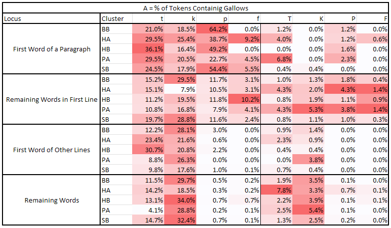
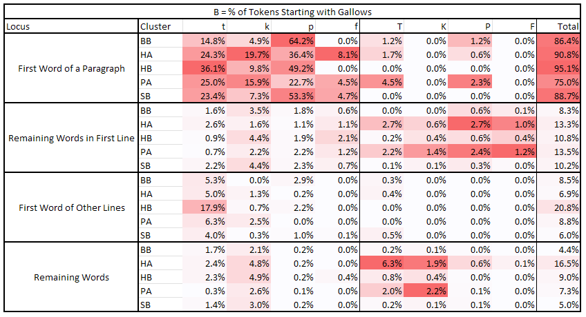
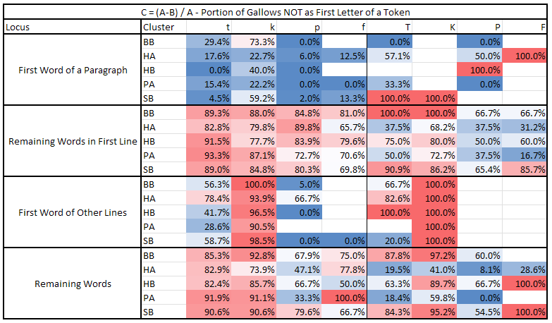

# Note 010 - Character Distribution Through Clusters

_Last updated Dec. 28th, 2024._

_This note refers to [release v.13.0.0](https://github.com/mzattera/v4j/tree/v.13.0.0) of v4j;
**links to classes and files refer to this release**; files might have been changed, deleted or moved in the current master branch.
In addition, some of this note content might have become obsolete in more recent versions of the library._

_Working notes are not providing detailed description of algorithms and classes used; for this, please refer to the 
library code and JavaDoc._

_Please refer to the [home page](..) for a set of definitions that might be relevant for this working note._

[**<< Home**](..)

---

# Abstract

It is known since the very beginning of Voynich studies, that the distribution of character within the pages presents some statistical anomalies.
This note looks into it, using for the first time the
[Slot transcription](https://github.com/mzattera/v4j/blob/master/eclipse/io.github.mzattera.v4j/src/main/resources/Transcriptions/Interlinear_slot_ivtff_1.5.txt).

Not all of the findings here are original, but I think there are some insight never reported before, this also because I am using the [Slot alphabet](../alphabet)
for my analysis.

**Unless differently indicated, the rest of this note uses the Slot alphabet when quoting Voynich text (e.g. 'SEdy' corresponds to EVA 'sheedy').** 

# Methodology

In this note I will show the result of several experiments. In each experiment, the text of the Voynich is split into two parts,
for example initial lines of every paragraph will form the first part of text, whilst the other lines will be in the second part;
the character distribution of the two parts is compared using a chi-squared test, where each "bin" is a character.
If the test shows a statistically significant variation, then each character is tested individually (using a binomial test),
to highlight which characters behave significantly differently in the two parts of the text.

In all experiments, the [concordance version](https://github.com/mzattera/v4j#ivtff)
of the Voynich in the Slot alphabet is used; only text appearing in paragraphs is considered (IVTFF locus type = P0 or P1).
The experiments are done separately for each [cluster](../003).

The set of experiments is as follows:

  * First line in page - first lines of pages are compared with the rest of the text.
  * First line in paragraph - first lines of paragraphs are compared with the rest of the text.
  * Last line in paragraph - last lines of paragraphs are compared with the rest of the text.
  * First letter in a line - initial character of first token in a line is compared with initial characters of all other tokens.
    For reasons that will be clearer later, the first line of each paragraph (thus the first token) is ignored.
  * Last letter in a line - final character of last token in a line is compared with last characters of all other tokens.

The results are shown in the below table[{1}](#Note1)[{2}](#Note2):

As a test, experiments have been repeated with a shuffled version of the Voynich where the layout (number of tokens in each line) has been preserved but tokens were shuffled around randomly,
and the anomalies in distribution disappeared.
	 
# Considerations and Previous Works

## (Pedestalled) Gallows

Before analyzing the above results, I want to discuss the distribution of "gallows" characters ('p', 't', 'k', 'f', 'P', 'T', 'K', 'F').
For the purpose, I have prepared the following set of tables[{3}](#Note3)[{4}](#Note4);
all tables have been prepared using the [majority transliteration](https://github.com/mzattera/v4j#ivtff) of the Voynich, using the Slot alphabet.
The analysis has been done by splitting the text in clusters and then considering different parts the text:

  * First Word of a Paragraph
  * Remaining Words in First Line of each paragraph
  * First Word of Other Lines that are not the first line of a paragraph
  * Remaining Words (not in first line of a paragraph and not at the beginning of a line)

The first table shows the percentage of tokens containing a given character (we call this value A) for each of these four parts of the text. 

The second table shows the percentage of tokens starting with gallows (we call this value B). 

Finally, the third tables computes (A-B)/A. A value of 0% means all occurrences of a character are at the beginning of a token whilst a value of
100% means all occurrences of a character are inside a token.

Comparing these three tables and considering the one with characters distribution, we can conclude the following:

  1. 't', 'p', and 'f' appear in first line of paragraphs more frequently than in other places. This behavior is not confirmed for 't' in the Herbal pages.
  
  2. When 't' and 'p' appear in the first line of a paragraph, they tend to appear in the first token of the line.
     This behavior is especially marked in 'p'. 'f', on the other hand, does not show this behavior.
  
  3. When 't', 'p', and 'f' are in the first token of a paragraph, they tend to be the first character of that token.
     This behavior is reversed when they are in the first line of a paragraph but not in the first token, meaning the tokens in first line after the
	 first tend not to begin with, but rather contain, 't', 'p', or 'f'.
	 
	 This behavior is dubious for other lines of the paragraph, where 'p' and 'f' are basically absent, but still marked for 't'.

  4. 'k' has an specular behavior; it tends to avoid the first line of paragraphs, preferring to appear in other lines. It also avoids appearing
     as initial of tokens; this last behavior is less marked when it appears in the first token of a paragraph.
  	  
  6. The "pedestalled gallows" seem to follow the same behavior of their "non-pedestalled" counterparts; thus 'T' behaves like 't' (its
     distribution seems more uniform across lines though), 'P' like 'p', 'F' like 'f', and 'K' like 'k',
	 with the exception that they tend to avoid being token initials (especially 'K');
	 notice how 'K', 'P', and 'T' appear significantly less as first character in a line.
	 However, this last part is difficult to confirm, given the small number of these glyphs.
	 
  7. From 75% (for Pharmaceutical) to 95% (for Herbal B) of paragraphs begins with "gallows".
 

With the exception of point 4. and last half of point 3.,  which might constitute new findings, other behaviors are long known;
see, among others,[TILTMAN (1967)](../biblio.md)[{5}](#Note5), [CURRIER (1976)](../biblio.md)[{6}](#Note6),
[D'IMPERIO (1978b)](../biblio.md)[{7}](#Note7), [Grove](http://voynich.net/Arch/2004/09/msg00478.html)[{8}](#Note8),
[BOWERN (2020)](../biblio.md) (mentioning Grove), and [ZANDBERGEN (2021)](../biblio.md).

It is interesting that, even with variations and very few exceptions, the above rules apply to all of the different clusters,
this is somewhat surprising, given that we know that "languages" for each cluster are structurally different (see [Note 009](../009)).
	 

## First Line in a Page

The distribution of characters in the first line of a page seems to roughly follow the same patterns shown by characters appearing in first line of a paragraph.
For the time being, I will assume that the differences between first line of a page and first line in a paragraph are only due to the fact that,
being the sample much smaller for beginning of pages, the trends are just less marked.

## First Line in a Paragraph

  1. As already discussed above, 'f', 'F', 'p', 'P' tend to appear more frequently in first line of paragraphs, same holds true for 't', except for
     the Herbal pages, 'k' and 'K' have the opposite behavior, tending to appear more frequently outside the first line, finally, not much can be said about 'T'.
  2. There is also a preference for 'S' to appear in first line of paragraphs.
  3. 'e' seems to appear more frequently without repetitions in first line (see low frequencies of 'E' and 'B').
  4. 'n' avoids the first line of paragraphs.
  5. With the exception of the Pharmaceutical section, 'J' avoids the first line of paragraphs.
  6. For the Biological and Stars sections only, 'r' and 'o' seems over-represented in first line, the opposite is true for 's'.

To my knowledge, with the exception of point 1., these are new findings which are due to:

  - Using the Slot alphabet for the analysis rather than EVA.
  
     For example, Slot 'S' is a single character represented in EVA as two characters ('sh'), this makes difficult, if not impossible,
	 for analysis based on EVA to spot the abundance of 'sh' in first line, as the statistics will be skewed by single occurrences of EVA 's'
	 or EVA sequences like 'ch' 'cth', etc.
	 
  - Performing a separate analysis for each cluster (for point 6).

## Last Line in a Paragraph

   1. 'f', 't' and especially 'q' and 'p' tend to avoid last line of paragraphs.
   
I found no mention of this before.

## First Letter in a Line

To perform this analysis, the first token of each paragraph has been ignored, as we already know from the analysis above that
that token will most likely start with gallows (thus skewing our analysis).

  1. 't' and less markedly 'p', are over-represented at line start; the opposite is true for 'k', confirming our analysis of gallows above.
  2. 's', 'y', and 'd' (with exception for Herbal A) are also over-represented at line start.
  3. 'C' and, less markedly, 'S' are under-represented at line start.
  4. 'a', 'o' (with exception of Herbal A where it shows opposite behavior), and, less markedly, 'r' are under-represented at beginning of a line. 

Again, much of this is not new: [CURRIER (1976)](../biblio.md) states that 
"The frequency counts of the beginnings and endings of lines are markedly different from the counts of the same characters internally" and he noticed how 
'C' and 'S' are under-represented (unless followed by 'o').
 
[TILTMAN (1967)](../biblio.md) noticed that "'y' occurs quite frequently as the initial symbol of a line followed immediately by a combination of symbols which seem
to be happy without it in any part of a line away from the beginning".
    
[BOWERN (2020)](../biblio.md) mentions that "The
first token is somewhat more likely to begin with s- s. This may be another orthographic
variant, but it appears to only occur with tokens that otherwise begin with o- o or a- a. Thus
aiin aiin, ol ol, and or or are replaced with saiin saiin, sol sol, and sor sor." this is consistent with
points 2. and 4. above.

## Last Letter in a Line

  1. 'm' is over represented at the end of lines.
  2. Conversely, 'l' and 'r' are under-represented.
  3. For some clusters, 'd', 'o', 'n', and 'y' shows a significant deviation in their distribution.
 
 Point 1. is a well known fact in [TILTMAN (1967)](../biblio.md), [CURRIER (1976)](../biblio.md), [BOWERN (2020)](../biblio.md),
 and [ZANDBERGEN (2021)](../biblio.md). 

# Conclusions

The distribution of characters across the page presents some anomalies which are statistically significant and are summarized in the table above.
Many of these anomalies have been detected by several authors in the past, but some are possibly new:

   1. 'k' and 'K' behaving differently then other gallows.
   2. 'f', 't' and especially 'q' and 'p' tend to avoid last line of paragraphs.
   3. 'S' prefers to appear in first line of paragraphs.
   4. 'e' seems to appear more frequently without repetitions in first line (see low frequencies of ‘E’ and ‘B’).
   5. 'n' avoids the first line of paragraphs.
   6. With the exception of the Pharmaceutical section, 'J' avoids the first line of paragraphs.
   7. For the Biological and Stars sections only, 'r' and 'o' seems over-represented in first line, the opposite is true for 's'.

Again, these possibly new insights were only possible becasue the slot alphabet was used for analysis and the analysis has been conducted for each cluster separately.

Last but not least, worth mentioning as a few characters behave differently in different clusters.

	
---

**Notes**

<a id="Note1">**{1}**</a> Class [`CharDistributionAnalysis`](https://github.com/mzattera/v4j/blob/v.13.0.0/eclipse/io.github.mzattera.v4j-apps/src/main/java/io/github/mzattera/v4j/applications/chars/CharDistributionAnalysis.java) was used for this purpose.

<a id="Note2">**{2}**</a> The  file `Character Distribution.xlsx` in [this folder](https://github.com/mzattera/v4j/blob/master/resources/analysis/char%20distribution) contains 
detailed results of the analysis.

<a id="Note3">**{3}**</a> Class [`CountGallows`](https://github.com/mzattera/v4j/blob/v.13.0.0/eclipse/io.github.mzattera.v4j-apps/src/main/java/io/github/mzattera/v4j/applications/chars/CountGallows.java) was used for this purpose.

<a id="Note4">**{4}**</a> The  file `CountGallows.xlsx` in [this folder](https://github.com/mzattera/v4j/blob/master/resources/analysis/char%20distribution) contains 
all of the tables.

<a id="Note5">**{5}**</a> "(c) Paragraphs nearly always begin with D or H, most commonly
in the second variant forms, which also occur frequently in words in
the top lines of paragraphs where there is some extra space." (p. 7).

<a id="Note6">**{6}**</a> "'p' & 'f' appear 90-95% of the time in the first lines of paragraphs, in some 400 occurrences in one section of the manuscript" (p. 8).

"The 'ligatures' [ "pedestalled gallows" nda ] can never occur as paragraph initial, and almost never line initial." (p. 9) this is only partially true.

<a id="Note7">**{7}**</a> "(14) On most herbal folios the first line of the first paragraph begins with a very small set of symbols,
    primarily 't', 'k', 'p', 'f'" (p. 28).
		
<a id="Note8">**{8}**</a> John Grove seems to be the first person to notice that "First Gallows on a page can normally be detached from the first word to form a relatively normal VMS word",
suggesting these characters might be additions to the token (see also [this message](http://voynich.net/Arch/2004/09/msg00442.html) from Stolfi, which picks up on this).

On this point, please see [Note 005](../005) where I show, given the slot structure of Voynich words, that removing the initial character from a word results in another valid word in a minimum of 60% of cases.
Still, I think there is good evidence that the initial gallows in paragraphs might be an addition to the actual token. If this is done for aesthetic reasons or is part of the encoding scheme 
(as Grove suggests) I cannot tell.

---

[**<< Home**](..)

Copyright Massimiliano Zattera.

 This work is licensed under a <a rel="license" href="http://creativecommons.org/licenses/by-nc-sa/4.0/">Creative Commons Attribution-NonCommercial-ShareAlike 4.0 International License</a>.
