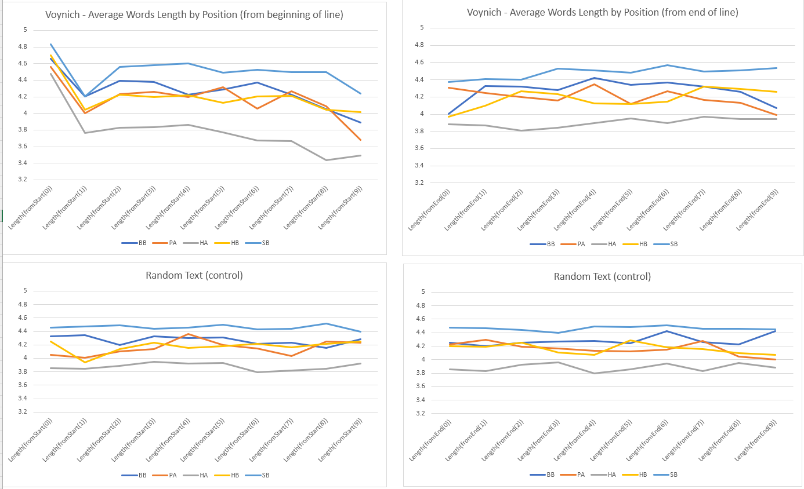

# Note 011 - On Word Types Length

_Last updated Sep. 18th, 2022._

_This note refers to [release v.14.0.0](https://github.com/mzattera/v4j/tree/v.14.0.0) of v4j;
**links to classes and files refer to this release**; files might have been changed, deleted or moved in the current master branch.
In addition, some of this note content might have become obsolete in more recent versions of the library._

_Working notes are not providing detailed description of algorithms and classes used; for this, please refer to the 
library code and JavaDoc._

_Please refer to the [home page](..) for a set of definitions that might be relevant for this working note._

[**<< Home**](..)

---

# Abstract

In [VOGT (2012)](../biblio) there is an interesting analysis of types length across the Voynich. In this note I am trying to replicate the results:

  - By using the [Slot alphabet](../alphabet).
  - Conducting a separate analysis for each [cluster](../003).

 
# Methodology

For this note, the [majority version](https://github.com/mzattera/v4j#ivtff) of the Voynich was used; only the text in running paragraphs (IVTFF locus type = P0 or P1) is considered
and tokens containing unreadable characters were ignored.

The average length of tokens is then calculated[{1}](#Note1):

  - Considering tokens in same position in the line (e.g. first, second, third token in a line, etc.).
  - Same but counting backwards (last token, second last, etc.).
  - Considering tokens in same line of a paragraph, starting from top.
  - Same but from bottom.
 
In addition, the same process is repeated for a text where the Voynich tokens were randomly shuffled, as a test. 

The results are shown below[{2}](#Note2):
 

  

# Considerations and Comparison with Previous Works

Vogt makes three observations in his article:

  1. The first token of a line is longer than average.
  2. The second token is shorter.
  3. Over the course of the line, the average token length drops.
  
     This effect is carefully analyzed and "explained away" as "the result of text
     composition along lines, namely that short words will result in lines with more
     words, and thus higher word counts".
	 
My analysis confirms all of the three observation, for each cluster separately.

For point 1., for which Vogt has no explanation, I suggest, as seen in [Note 10](../010) and in [BOWERN (2020)](../biblio.md), 
this might the effect of prefixes added to first word in a line.

For point 2., I also have no clue so far as why it happens.

In addition, I checked if a similar phenomenon happens at the end of lines, but I cannot see any anomaly there.
This should indirectly confirm Vogt's analysis of point 3..

In this note I also do an analysis based on position of tokens in lines; this clearly shows tokens in first line are 
on average longer than those appearing in other lines. I think it is fair to attribute this to the presence of "Grove" 
words in the first line of paragraphs (see [Note 10](../010)).

# Conclusions

The behaviors indicate by Vogt are confirmed. In addition, 

  - Tokens at end of lines seem to behave "normally" in terms of length.
  - Tokens in first line of each paragraph tend to be longer on average.

---

**Notes**

<a id="Note1">**{1}**</a> Class [`WordLength`](https://github.com/mzattera/v4j/blob/v.14.0.0/eclipse/io.github.mzattera.v4j-apps/src/main/java/io/github/mzattera/v4j/applications/words/WordLength.java) was used for this purpose.

<a id="Note2">**{2}**</a> The  file `Word Length.xlsx` in [this folder](https://github.com/mzattera/v4j/blob/master/resources/analysis/words) contains 
detailed results of the analysis, including diagrams.

---

[**<< Home**](..)

Copyright Massimiliano Zattera.

 This work is licensed under a <a rel="license" href="http://creativecommons.org/licenses/by-nc-sa/4.0/">Creative Commons Attribution-NonCommercial-ShareAlike 4.0 International License</a>.
