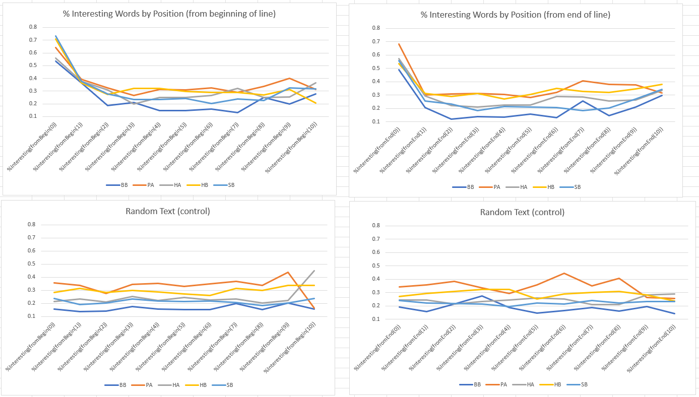
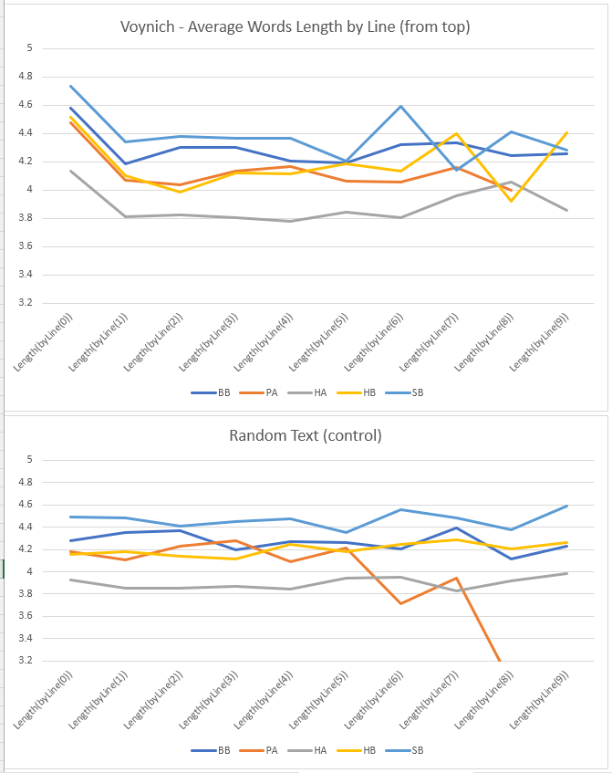

# Note 012 - Mind your Words

_Last updated Apr. 13th, 2025._

_This note refers to [release v.15.0.0](https://github.com/mzattera/v4j/tree/v.15.0.0) of v4j;
**links to classes and files refer to this release**; files might have been changed, deleted or moved in the current master branch.
In addition, some of this note content might have become obsolete in more recent versions of the library._

_Working notes are not providing detailed description of algorithms and classes used; for this, please refer to the 
library code and JavaDoc._

Unless differently stated, this note uses the [Slot alphabet](../alphabet).

_Please refer to the [home page](..) for a set of definitions that might be relevant for this working note._

[**<< Home**](..)

---

# Abstract

In previous [note 10](../010) and [11](../011); we saw how words behave differently at different position of the text; below a quick summary, please refer to original notes for details.

First line of paragraphs:

  1. Tokens in first line of each paragraph tend to be longer than other tokens, on average.
  1. Gallows (except for 'k' and 'K') tend to appear more frequently in first line of paragraphs, preferably in the first token of the line.
  1. There is also a preference for 'S' to appear in first line of paragraphs.
  1. Some "endings" (e.g. 'E', 'B', and 'n') avoids the first line of paragraphs.

First token in a line:

  1. The first token of a line is longer than average.
  1. Some characters, like 't', 'p', 's', 'y', and 'd' are over-represented at line start. 
  1. Others characters, like 'k', 'C', 'S', 'a', and 'r' are under-represented.
  
Second token in a line:
 
   1. The second token of a line is shorter than average.
   
Last token in a line:

  1. 'm' is over represented, conversely, 'l' and 'r' are under-represented.
  3. For some clusters, 'd', 'o', 'n', and 'y' shows a significant deviation in their distribution. 

 In this note I want to explore the hypothesis that there must be some word types that appear only in those positions of the text, which are responsible for the above patterns.
 
# Methodology

For this note, the [majority version](https://github.com/mzattera/v4j#ivtff) of the Voynich was used; only the text in running paragraphs (IVTFF locus type = P0 or P1) is considered
and tokens containing unreadable characters were ignored.

In the first test, I divide tokens in buckets, one per position in the line, so all tokens appearing at the beginning of a line are in the first bucket, those appearing in second position
in a line go into the second bucket and so on.

I then calculate, for each bucket, the percentage of word types that appear significantly more often in a bucket, compared to totality of other buckets.

The experiment has been conducted separately for each [cluster](../003) in both directions (from beginning and end of line)[{1}](#Note1), results are shown below[{2}](#Note2).
For comparison, the experiment was also executed on a scrambled version of the text where tokens where shuffled at random.
 

  
Clearly there are word types that prefer to appear only at first position (and maybe second position too) or at end of line.

A similar experiment has been conducted by bucketing tokens based on which line in a paragraph they appear; below the results.
The spike at the end in PA is probably due to the fact this cluster contains paragraphs with few lines, so less words are in lines after the fifth.

This also confirms that some words prefer to appear at beginning of line.

# Conclusions

Our hypothesis seems confirmed: there are some word types that prefer to appear in first line of a paragraph, in first (and second?) or last position in a line.\
These special words might be responsible for the behaviors we see in the text that are summarized at the beginning of this note.

We can define a population of "**interesting words**" as those appearing preferably in a given position in the text (e.g. in first line of paragraphs), 
and contrast it with the "**standard population**", defined as the set of words that appears in a position that is not the first line of a paragraph, or the first, second or last position in a line.

---

**Notes**

<a id="Note1">**{1}**</a> Class [`InterestingWords`](https://github.com/mzattera/v4j/blob/v.14.0.0/eclipse/io.github.mzattera.v4j-apps/src/main/java/io/github/mzattera/v4j/applications/words/WordLength.java) was used for this purpose.

<a id="Note2">**{2}**</a> The  file `Intersting Words.xlsx` in [this folder](https://github.com/mzattera/v4j/blob/master/resources/analysis/words) contains 
detailed results of the analysis, including diagrams.

---

[**<< Home**](..)

Copyright Massimiliano Zattera.

 This work is licensed under a <a rel="license" href="http://creativecommons.org/licenses/by-nc-sa/4.0/">Creative Commons Attribution-NonCommercial-ShareAlike 4.0 International License</a>.
