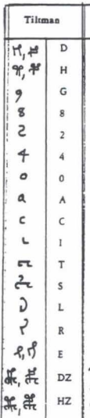

# Review 001 - TILTMAN, John H. (1967): THE VOYNICH MANUSCRIPT "The Most Mysterious Manuscript in the World"

_Last updated Oct. 23rd, 2021._

_A link to the text reviewed here can be found in my [bibliography page](../biblio.md)._

_Please refer to the [home page](..) for a set of definitions that might be relevant for this working note._

[**<< Home**](..)

---

The below is my own commented summary from [TILTMAN (1967)](../biblio.md) (mostly a shortened cut & paste from the original).

The original alphabet used by Tiltman is shown below (from [D'IMPERIO (1978b)](../biblio.md), Fig.19); in this summary
I replaced Tiltman's alphabet with [Slot alphabet](../005). Notice that Tiltman uses "variants", that is, some
transliterated letters correspond to two different glyphs; I indicated this with a dash
(e.g. Tiltman's 'H' is indicated as 't'-'p', where 'p' is considered by Tiltman a variant writing for 't').

From p.7:

* Limited the number of symbols in the transliteration alphabet to 17;
most of the alphabet aligns with that used in the First Study Group (FSG).

* It is useless to take account of rare combinations of symbols.
It is not even in every case possible to say what is a single
symbol and what is not (e.g. Tiltman mentions not being satisfied
that 'a' is resolved into 'ei' or possibly 'oi').

* No punctuation at all.

* 'T', 'K', 'P', 'F' appear to be infixes of 't', 'k', 'p', 'f' within 'C'.
I [argued](../005) there is evidence of the opposite, in my opinion.

* 'm' appears most commonly at the end of a line, rarely elsewhere.

* Paragraphs nearly always begin with 'k'-'f' or 't'-'p', most commonly
as 'f', 'p', which also occur frequently in words in
the top lines of paragraphs where there is some extra space.

* 'y' occurs quite frequently as the initial symbol of a line followed
immediately by a combination of symbols which seem to be happy
without it in any part of a line away from the beginning. Otherwise
it occurs chiefly at end of a word, very frequently preceded by 'd'.
Hence the belief that these two have some separative or conjunctive function. 

* However, 'y' also seems sometimes to take the place of 'o' before 
'k'-'f' or 't'-'p' (though rarely, if ever, after 'q');
this is particularly noticeable in some of the captions to illustrations 
in the astronomical section of the manuscript these most commonly begin 'ok'-'of' or 'ot'-'op'
and it is here that we occasionally see 'yk'-'yf' or 'yt'-'yp'.

* Tiltman divided words into "roots" and "suffixes".

| Roots					| Suffixes				|
| :---					|:---					|
|ok-, of-				|-an, -ain, -aJn, -aUn	|
|ot-, op-				|-ar, -air, -aJr, -aUr	|
|qok-, qof-				|-al, -ail, -aJl, -aUl	|
|qot-, qop-				|-or					|
|C-						|-ol					|
|S-						|-ey, -Ey, -By			|
|d-						|-edy, -Edy, -Bdy		|
|s-						|						|
|lk-, lf-, mk-, mf- *	|						|

  (*) Notice these roots are missing from D'IMPERIO (1978b)](../biblio.md), Fig.27.
  
  Regarding the '-a' or '-o' suffixes, Tiltman points out that some of the combinations are very rare, while other are very common.

* Suffixes beginning with -a' have their own characteristic frequency throughout the manuscript and independent of context
  (except in cases where two or more '-a' are together in series, as referred to later).
  
* '-a' groups frequently occur attached directly to "roots", particularly 'ok'-'of', 'ot'-'op', 'd', and 's'.
  'okaJn'-'ofaJn', 'qokaJn'-'qofaJn', and 'daJn' rank high among the commonest words in the manuscript.

* There are however many examples of 2, 3, 4 or even 5 '-a' groups
strung together on end with or without spaces between them. When
this occurs, there appears to be some selective preference. For example,
'ar' is very frequently doubled, i.e., 'ar ar', whereas 'aJn' which is
generally significantly commoner, is rarely found doubled. Perhaps
the commonest succession of three of these groups is 'ar ar al'-'ar ar am'.
'al'-'am' very frequently follows 'ar', but 'ar' hardly ever follows 'al'-'am'.

* 'o', which has a very common and very definite function in
"roots",  seems to occur frequently in "suffixes" in rather similar usage
to 'a', but nearly always as 'or' and 'ol'-'om'. 'or aJn' is very common.

* If all the possible 'a' and 'o' combinations can occur, then
there are 24 possibilities. They may, however, be modified or qualified
in some way by the prefixed symbols 'k'-'f', 't'-'p', 'ok'-'of', 'ot'-'op',
'C', 'S', 'd', 's', etc., but Tiltman was unable to come to any conclusion.

* 'l'-'m', usually preceded by 'a' or 'o', is very commonly followed by 'k'-'f',
much less commonly by 't'-'p', with or without a space between. Tiltman suggests
that a space must not necessarily be regarded as words separator.

* Speaking generally, each symbol behaves as if it had its own
place in an "order of precedence" within words; some symbols such as
'o' and 'y' seem to be able to occupy two functionally different places.

  Notice this is very in line with the ["slots" concept](../005).

* Some of the commoner words, e.g., 'okeey'-'ofeey', 'okeedy'-'ofeedy',
'qokeey'-'qofeey', 'okaJn'-'ofaJn', 'okar'-'ofar', 'okal'-'ofal'-'okam'-'ofam',
'daJn', 'Cedy' occur twice running, occasionally three times.

* The occurrence of 'e' up to 3 times in one form of "suffix" and the symbol 'i'
up to 3 times in the other must have some systematic significance.

* Peter Long has suggested to the author the 'a' groups might represent Roman numerals
(e.g. 'ar ar al'-'ar ar am' for XXV). Though it
accounts for the properties of the commoner combinations, it produces
many impossible ones.

* Tiltman identifies some "key-like" sequences where symbols occur singly, apparently in series,
and not in their normal functions. In all cases there are symbols which rarely, if ever, occur elsewhere.

  * The column of symbols at the left in <f.49v> appears to show a repeating cycle
of 6 or 7 symbols 'k'-'f' (or 't'-'p'), 'o', 's', 'y', 'e', ?.

  * In <f.57v> the succession of
symbols in the circles must surely have some significance. One circle
has the same series of 17 symbols repeated 4 times.

  * <f.66r> also has an interesting column of symbols.

  Notice Tiltman misses two other such sequences:
  
  * <f.1r>	Sequences of single characters in the right margin, faded or erased.
  
  * <f.76r>	A vertical sequence of single characters in the left margin, aligned with some of the lines of writing.

* Tiltman claims his analysis shows that the text cannot be the result
of substituting single symbols for letters in the natural order:

  "_Languages simply do not behave in this way. If the single words attached
to stars in the astronomical drawings, for instance, are really, as they
appear to be, captions expressing the names or qualities of those stars,
there can hardly he any form of transposition system involved. And
yet I am not aware of any long repetitions of more than 2 or 3 words
in succession, as might he expected for instance in the text under the
botanical drawings._"
  

	
---

[**<< Home**](..)

Copyright Massimiliano Zattera.

 This work is licensed under a <a rel="license" href="http://creativecommons.org/licenses/by-nc-sa/4.0/">Creative Commons Attribution-NonCommercial-ShareAlike 4.0 International License</a>.
