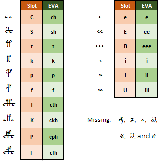

# The Slot Alphabet

[**<< Home**](./index.md)

---

The Slot alphabet is my proposal for a new transliteration alphabet; you can find the reasons behind this proposal in [Note 005](./005).

The alphabet is very similar to basic EVA, with the difference that some combinations of EVA characters (the pedestals, the gallows and the 'i' and 'e' sequences) are represented in the Slot alphabet by a single 
uppercase letter; these differences are summarized in the table below.

	
---

[**<< Home**](./index.md)

Copyright Massimiliano Zattera.

 This work is licensed under a <a rel="license" href="http://creativecommons.org/licenses/by-nc-sa/4.0/">Creative Commons Attribution-NonCommercial-ShareAlike 4.0 International License</a>.
